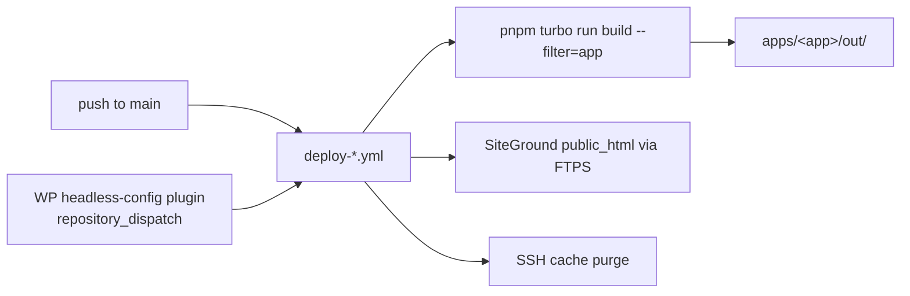

# .github/workflows — overview

CI/CD for the monorepo: one independent deploy workflow per site. Each builds a single app's static export with Turborepo and uploads it to that site's SiteGround `public_html` via FTPS, then purges the SiteGround cache over SSH.

## Contents
| Item | Type | Summary |
|------|------|---------|
| [deploy-umg.yml](deploy-umg.yml.md) | file | UMG → unitedmediadc.com (custom `um/v1` API mode) |
| [deploy-echo-media.yml](deploy-echo-media.yml.md) | file | Echo Media → echo-media.info (`API_MODE=wp`, WP auto-rebuild) |
| [deploy-international-spectrum.yml](deploy-international-spectrum.yml.md) | file | International Spectrum → internationalspectrum.org (`API_MODE=wp`, `ARTICLE_META=author`, WP auto-rebuild) |

## Connections

## Shared pattern
All three: trigger on push to `main` (path-filtered to own app + `packages/**`), `workflow_dispatch`, and `repository_dispatch`; per-app concurrency group with `cancel-in-progress`; ubuntu-latest, **Node 22**, pnpm from `packageManager` (11.5.2), `pnpm install --frozen-lockfile`; `SamKirkland/FTP-Deploy-Action@v4.4.0`; `appleboy/ssh-action@v1` cache purge on port 18765.

## Differences
| | UMG | Echo Media | Intl Spectrum |
|---|---|---|---|
| API mode | custom (`um/v1`) | `wp` | `wp` |
| Extra env | — | — | `NEXT_PUBLIC_ARTICLE_META: author` |
| WP auto-rebuild dispatch | `deploy-umg` | `deploy-echo-media` | `deploy-international-spectrum` |
| Secret prefix | `UMG_` | `EM_` | `IS_` |

Secrets per site: `*_WP_API_URL`, `*_FTP_SERVER/USERNAME/PASSWORD`, `*_SSH_HOST/USERNAME/KEY`.

## Entry points
Push to `main`, manual dispatch from the Actions tab, or a WordPress post change (via the headless-config plugins — see [plugin/](../../plugin/README.md)).

---
*Documented at commit 1cbdce5.*
