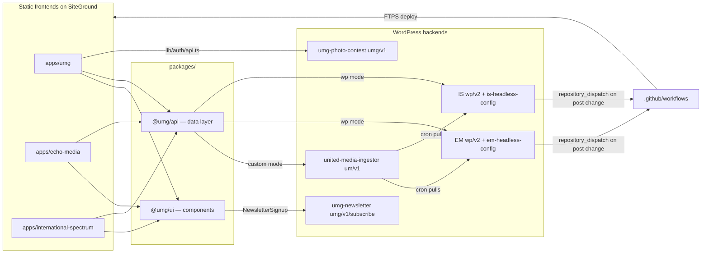

# umg-headless — codebase documentation

Documentation mirror of the repository: one doc per source file (same path + `.md`), one `README.md` per folder. Start here, drill down via the folder READMEs. See also the [start-up guide](start-up-guide.md) for running everything locally.

## What this system is

A **headless WordPress** platform running three news sites from one pnpm + Turborepo monorepo. Each site is a statically exported Next.js 16 app served from SiteGround; content lives in WordPress backends on `api.*` subdomains and is fetched from the browser at runtime. Custom WordPress plugins (source in `docs/plugin/`, documented under [plugin/](plugin/README.md)) provide the aggregation API, photo-competition backend, newsletter endpoint, and per-site headless config (CORS, cache, auto-rebuild).

| Site | Domain | WP backend | API mode |
|------|--------|-----------|----------|
| United Media Group | unitedmediadc.com | api.unitedmediadc.com | `custom` — `um/v1/articles` (aggregated) |
| Echo Media | echo-media.info | api.echo-media.info | `wp` — standard `wp/v2` |
| International Spectrum | internationalspectrum.org | api.internationalspectrum.org | `wp` — standard `wp/v2` |

## Tree

| Item | Type | Summary |
|------|------|---------|
| [apps/](apps/README.md) | folder | The three Next.js sites (umg, echo-media, international-spectrum) — routing + config only |
| [packages/](packages/README.md) | folder | Shared workspace packages: [@umg/api](packages/api/README.md) (mode-switching data layer), [@umg/ui](packages/ui/README.md) (all components), [@umg/config](packages/config/README.md) (fixtures + tsconfig base) |
| [plugin/](plugin/README.md) | folder | WordPress plugin **source** (repo path `docs/plugin/`), deployed to the WP backends: united-media-ingestor, umg-photo-contest, umg-newsletter, per-site headless configs |
| [.github/](.github/README.md) | folder | Per-site deploy workflows (build static export → FTPS to SiteGround → cache purge) |
| [package.json](package.json.md) | file | Workspace root — pnpm 11.5.2 pinned, dev scripts |
| [pnpm-workspace.yaml](pnpm-workspace.yaml.md) | file | Workspace members (`apps/*`, `packages/*`) |
| [turbo.json](turbo.json.md) | file | Task graph (`build`, `dev`, `lint`) |
| [start-up-guide.md](start-up-guide.md) | file | How to run, build, and deploy — tool versions, env vars, external services |

## How the pieces connect

Key flows:
- **Content (UMG):** the [united-media-ingestor](plugin/united-media-ingestor/README.md) plugin pulls articles from the EM/IS backends + Diplomatic Watch into a local `um_article` CPT via cron, and serves them at `GET /wp-json/um/v1/articles`. [@umg/api](packages/api/README.md) fetches them in `custom` mode; articles link externally (blank `slug` convention → [ArticleLink](packages/ui/ArticleLink.tsx.md) renders `<a target="_blank">`).
- **Content (EM/IS):** `NEXT_PUBLIC_API_MODE=wp` makes [@umg/api](packages/api/wp-client.ts.md) use standard `wp/v2/posts?_embed`, adapted to the same `ApiArticle` shape; articles render internally at `/articles/[slug]` via [ArticleLayout](packages/ui/article/ArticleLayout.tsx.md), with comments.
- **Photo competition (UMG):** email-OTP auth → JWT → autosaved draft → photo uploads → submit → Stripe payment-link, polled via `GET /me`. Frontend in [apps/umg/lib/auth + photo-submission](apps/umg/README.md), backend in [umg-photo-contest](plugin/umg-photo-contest/README.md) (`/wp-json/umg/v1/`).
- **Publish-to-deploy:** EM/IS headless-config plugins fire GitHub `repository_dispatch` on post changes, triggering the matching [deploy workflow](.github/workflows/README.md) — content edits automatically rebuild the static site.

## Conventions in these docs

- Doc path = source path + `.md` (extension kept: `Header.tsx` → `Header.tsx.md`).
- "Dependencies → Internal" links point at the dependency's doc; direction in Connections graphs = "depends on".
- Plugin source lives at `docs/plugin/` in the repo but is documented here under `plugin/` (not `docs/plugin/`).
- Every doc ends with a `Documented at commit <sha>` footer — when updating docs after code changes, diff `git log <sha>..HEAD -- <source-path>` to see what changed since the doc was written.
