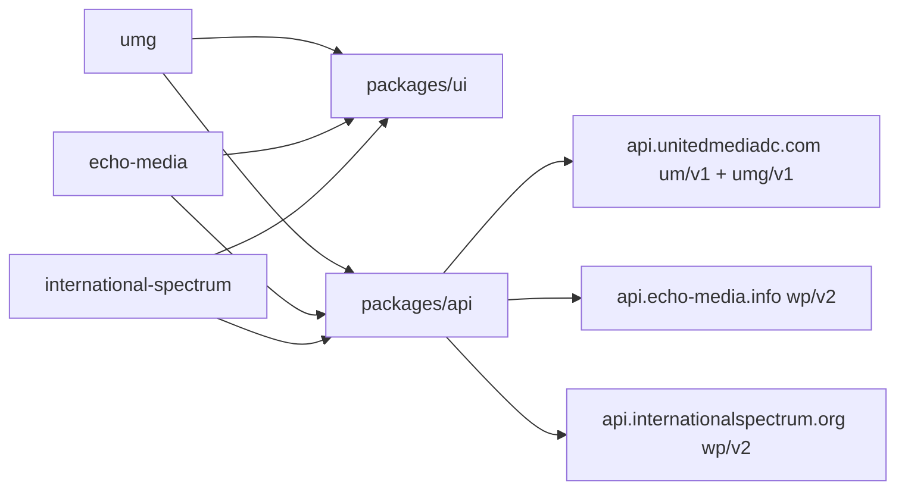

# apps — overview

The three deployable Next.js sites of the monorepo. Each is a statically exported app (`output: 'export'`, `trailingSlash: true`) that contributes only routing, site config, and brand assets — all real UI comes from [@umg/ui](../packages/ui/README.md) and all data access from [@umg/api](../packages/api/README.md). Each deploys independently to SiteGround via its own [GitHub Actions workflow](../.github/workflows/README.md).

## Contents
| Item | Type | Summary |
|------|------|---------|
| [umg/](umg/README.md) | app | United Media Group (unitedmediadc.com) — news aggregator with external article links + the photo competition (OTP auth, submissions, Stripe payment) |
| [echo-media/](echo-media/README.md) | app | Echo Media (echo-media.info) — standalone news site, internal articles, 3 categories, blue branding |
| [international-spectrum/](international-spectrum/README.md) | app | International Spectrum (internationalspectrum.org) — standalone news site, 7 categories, yellow branding, video interviews |

## How they differ
| | umg | echo-media | international-spectrum |
|---|---|---|---|
| API mode | `custom` (`um/v1/articles` via [united-media-ingestor](../plugin/united-media-ingestor/README.md)) | `wp` (`wp/v2/posts`) | `wp` (`wp/v2/posts`) |
| Articles | External links to source sites (no detail pages) | Internal `/articles/[slug]` | Internal `/articles/[slug]` + YouTube `videoUrl` embeds |
| Extra features | Photo competition (`/how-to-enter`, `/judges-panel`, `/photo-submission`) backed by [umg-photo-contest](../plugin/umg-photo-contest/README.md) | — | `NEXT_PUBLIC_ARTICLE_META=author` |
| WP backend | api.unitedmediadc.com | api.echo-media.info ([em-headless-config](../plugin/em-headless-config.php.md)) | api.internationalspectrum.org ([is-headless-config](../plugin/is-headless-config.php.md)) |

## Connections

## Entry points
Each app's `app/layout.tsx` (chrome + site config) and `app/page.tsx` (homepage sections). Dev: `pnpm dev:umg` / `dev:em` / `dev:is` from the repo root.

---
*Documented at commit 1cbdce5.*
