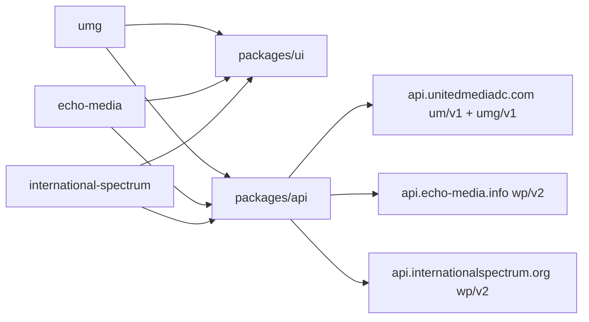

# apps — overview

The three deployable Next.js sites of the monorepo. Each is a statically exported app (`output: 'export'`, `trailingSlash: true`) that contributes only routing, site config, and brand assets — all real UI comes from [@umg/ui](../packages/ui/README.md) and all data access from [@umg/api](../packages/api/README.md). `umg` is the one exception: alongside the shared news chrome it carries app-specific routes, components and REST clients of its own (photo competition, school bulk registration, judge panel). Each deploys independently to SiteGround via its own [GitHub Actions workflow](../.github/workflows/README.md).

## Contents
| Item | Type | Summary |
|------|------|---------|
| [umg/](umg/README.md) | app | United Media Group (unitedmediadc.com) — news aggregator with external article links, plus the photo competition (OTP auth, submissions, Stripe payment), school bulk registration, and the judge panel at `/admin`. Competition postponed indefinitely since 2026-08-13; `/admin` stays live |
| [echo-media/](echo-media/README.md) | app | Echo Media (echo-media.info) — standalone news site, internal articles, 3 categories, blue branding |
| [international-spectrum/](international-spectrum/README.md) | app | International Spectrum (internationalspectrum.org) — standalone news site, 6 categories, yellow branding, video interviews |

## How they differ
| | umg | echo-media | international-spectrum |
|---|---|---|---|
| API mode | `custom` (`um/v1/articles` via [united-media-ingestor](../plugin/united-media-ingestor/README.md)) | `wp` (`wp/v2/posts`) | `wp` (`wp/v2/posts`) |
| Articles | External links to source sites (no detail pages) | Internal `/articles/[slug]` | Internal `/articles/[slug]` + YouTube `videoUrl` embeds |
| Categories | 8 configured, but only the populated ones are linked — 4 today, resolved at build time by [lib/activeCategories.ts](umg/lib/activeCategories.ts.md) | 3 | 6 (incl. a `video-interviews` bucket) |
| Extra features | Photo competition (`/how-to-enter`, `/judges-panel`, `/photo-submission`) + school bulk registration (`/school-registration`) + judge panel (`/admin`), all backed by [umg-photo-contest](../plugin/umg-photo-contest/README.md); also the only app with `/sitemap.xml` and `/robots.txt` routes | — | `NEXT_PUBLIC_ARTICLE_META=author` |
| WP backend | api.unitedmediadc.com | api.echo-media.info ([em-headless-config](../plugin/em-headless-config.php.md)) | api.internationalspectrum.org ([is-headless-config](../plugin/is-headless-config.php.md)) |

## Diplomatic Watch removal (client request, 2026-10-01)
DW was cut from all three sites at once, and it touched more than branding:

- **Branding (all three apps):** its `dw-logo.png` / `dw-logo-black.svg` were deleted from every `public/images/banner/` folder and its entry dropped from every `lib/mediaCompanies.ts`, so each site's marquee banner now cross-promotes **two** sibling brands instead of three.
- **Content (umg only):** DW was 92.4% of the ingested corpus (2,597 of 2,811 articles). The [ingestor](../plugin/united-media-ingestor/README.md) dropped it as a source in 0.12.0 and the articles have since been purged — **215 remain**, all Echo Media and International Spectrum.
- **Empty buckets (umg only):** that left four of umg's eight nav categories with no articles, which is why umg alone filters its nav, footer and homepage sections through `getActiveCategories()`.

## Connections

```mermaid
graph LR
  umg --> ui[packages/ui]
  umg --> api[packages/api]
  em[echo-media] --> ui
  em --> api
  is[international-spectrum] --> ui
  is --> api
  api --> wpUMG[api.unitedmediadc.com um/v1 + umg/v1]
  api --> wpEM[api.echo-media.info wp/v2]
  api --> wpIS[api.internationalspectrum.org wp/v2]
```

## Entry points
Each app's `app/layout.tsx` (chrome + site config) and `app/page.tsx` (homepage sections). In `umg` both are `async` — they await the build-time active-category filter before rendering the Header/Footer and the homepage sections; echo-media's and international-spectrum's stay synchronous. Dev: `pnpm dev:umg` / `dev:em` / `dev:is` from the repo root.

---
*Documented at commit 6e04fee.*
