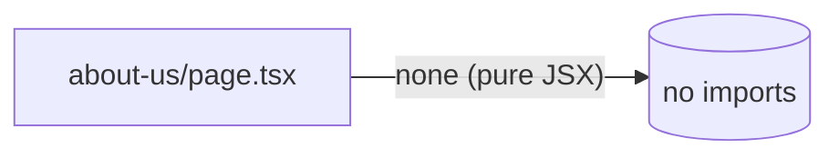

# apps/echo-media/app/about-us — overview

Static About Us route (`/about-us`) — hard-coded Echo Media mission/vision/values copy with a contact call-to-action. No data fetching.

## Contents
| Item | Type | Summary |
|------|------|---------|
| [page.tsx](page.tsx.md) | file | Static page: intro, Mission, Vision, six Core Values, Contact Us band (`mailto:info@unitedmediadc.com`). |

## Connections

## Entry points
- Route: `/about-us/` (statically exported; linked from the shared Footer).

---
*Documented at commit 1cbdce5.*
