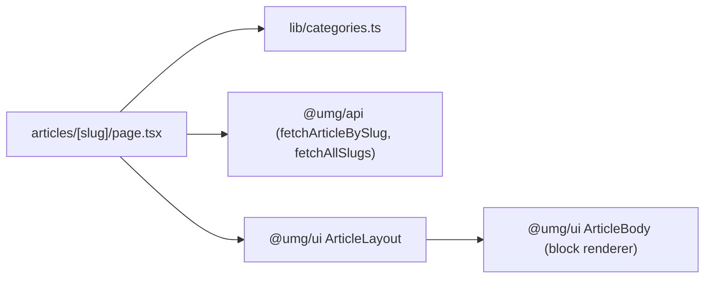

# apps/echo-media/app/articles/[slug] — overview

Article detail route — pre-renders every WordPress post at build time and displays it via the shared `ArticleLayout` (hero image, block-rendered body with images and galleries where the author placed them, comments, "More Articles" carousel).

## Contents
| Item | Type | Summary |
|------|------|---------|
| [page.tsx](page.tsx.md) | file | `generateStaticParams` from `fetchAllSlugs()`; per-article OG/Twitter metadata; renders `ArticleLayout` with category color map and `blocks`. |

## Connections

## Entry points
- Route: `/articles/<slug>/` — one static page per WP post slug; unknown slugs 404 (`dynamicParams = false`).

## Notes
- Because `blocks={article.blocks}` is passed, the body renders through [ArticleBody](../../../../../packages/ui/article/ArticleBody.tsx.md): images sit **inline at their authored positions** and a gallery block renders in place (usually at the end of the article), instead of every image being hoisted into one carousel above the body. `images`/`content` are still passed, but only feed `ArticleLayout`'s legacy fallback for posts without block data.

---
*Documented at commit 6e04fee.*
