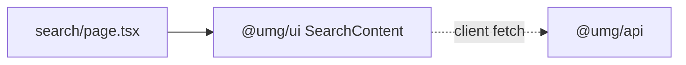

# apps/echo-media/app/search — overview

Search route (`/search?search=<query>`) — a one-component wrapper; all search UX lives in the shared `SearchContent`.

## Contents
| Item | Type | Summary |
|------|------|---------|
| [page.tsx](page.tsx.md) | file | Renders `<SearchContent />`; query parsing, fetching, pagination, and states are in `@umg/ui`. |

## Connections

## Entry points
- Route: `/search/` (reads `?search=` client-side; reached from the Header search box).

---
*Documented at commit 1cbdce5.*
