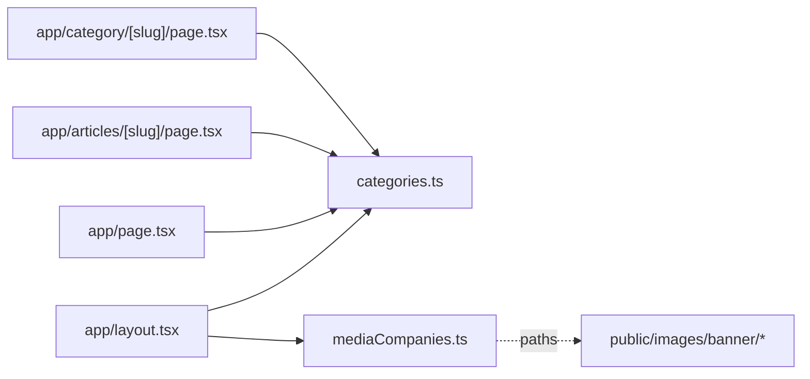

# apps/echo-media/lib — overview

Echo Media's per-site configuration: the category taxonomy and the sibling-brand list. These two files are where this app most visibly diverges from international-spectrum — the page/component code is otherwise near-identical between the two sites.

## Contents
| Item | Type | Summary |
|------|------|---------|
| [categories.ts](categories.ts.md) | file | 3 categories (Art & Culture, Education, Environment; all `#0281b3`) + Header/Footer nav groupings. |
| [mediaCompanies.ts](mediaCompanies.ts.md) | file | 3 cross-promoted brands (UMG, International Spectrum, Diplomatic Watch) with local banner logo paths. |

## Connections

## Entry points
- Not routed; imported by the `app/` pages. Category slugs must mirror the WordPress backend taxonomy.

---
*Documented at commit 1cbdce5.*
