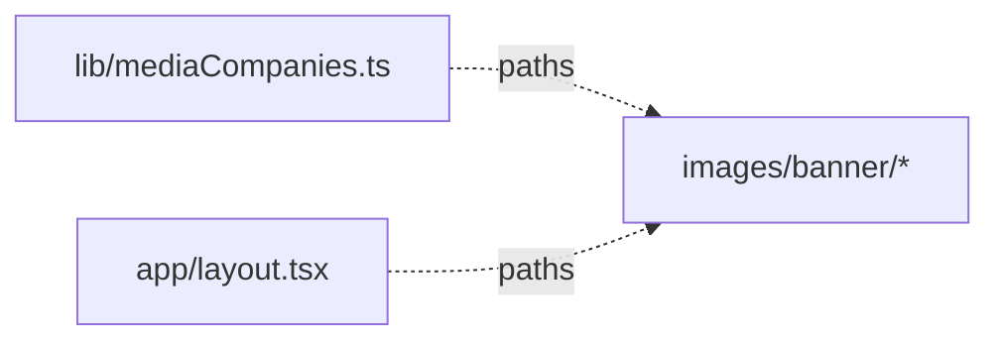

# apps/echo-media/public — overview

Static assets served from the site root. Currently holds only the localized banner logo set; the favicon lives in `app/icon.jpg` (App Router convention), not here.

## Contents
| Item | Type | Summary |
|------|------|---------|
| [images/banner/](images/banner/README.md) | folder | 8 brand logos (4 companies × color/B&W) for the Header marquee and Footer. |

## Connections

## Entry points
- Served at `/<path>` (e.g. `/images/banner/em-logo.svg`); copied verbatim into `out/` by the static export.

---
*Documented at commit 1cbdce5.*
