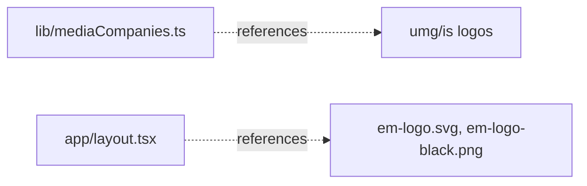

# apps/echo-media/public/images/banner — overview

Local marquee/footer logo assets for the United Media brand banner: three brands (this site plus the two siblings in [lib/mediaCompanies.ts](../../../lib/mediaCompanies.ts.md)) × two variants — color for the Header marquee, B&W for the Footer. 8 files, because the UMG masthead also keeps legacy PNG copies alongside the referenced SVGs. Previously served from WordPress uploads, now fully local.

## Contents
| Item | Type | Summary |
|------|------|---------|
| em-logo.svg | asset | Echo Media color logo — this site's own Header logo (`layout.tsx`). |
| em-logo-black.png | asset | Echo Media B&W logo — this site's own Footer logo (PNG due to original format). |
| umg-masthead.svg / umg-masthead.png | asset | United Media Group color masthead (SVG referenced by `mediaCompanies.ts`; PNG legacy copy, unreferenced). |
| umg-masthead-black.svg / umg-masthead-black.png | asset | UMG B&W masthead (SVG referenced; PNG legacy copy, unreferenced). |
| is-logo.svg | asset | International Spectrum color logo (marquee). |
| is-logo-black.svg | asset | International Spectrum B&W logo (footer). |

## Connections

## Entry points
- Served statically at `/images/banner/<file>`. To update a logo, replace the same-named file in **all three** app copies (echo-media, international-spectrum, umg).

## Notes
- `dw-logo.png` / `dw-logo-black.svg` (Diplomatic Watch) were deleted from all three apps on 2026-10-01 when that brand was dropped from the banner.

---
*Documented at commit 0c47b38.*
