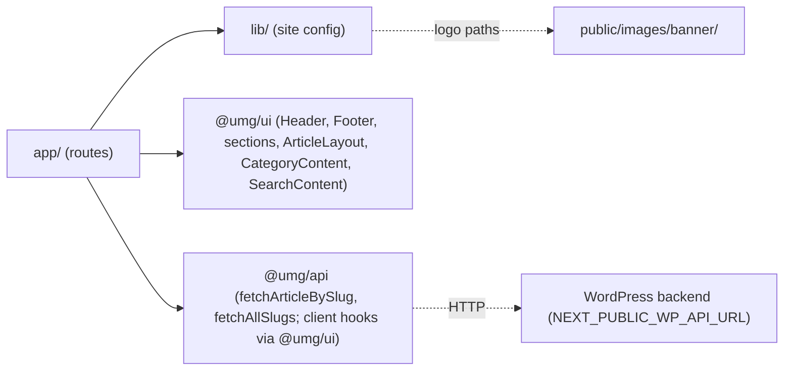

# apps/international-spectrum — overview

International Spectrum (internationalspectrum.org) — a global culture & lifestyle news site in the United Media network. It is a thin, statically exported Next.js 16 frontend over the headless WordPress backend: nearly all UI comes from the shared [@umg/ui](../../packages/ui/README.md) package and all data access from [@umg/api](../../packages/api/README.md); this app contributes only routing, site config (7 categories across 4 accent colors, yellow `#feb70c` branding), and static copy. Its structural twin is [apps/echo-media](../echo-media/README.md).

## Contents
| Item | Type | Summary |
|------|------|---------|
| [app/](app/README.md) | folder | App Router routes: home, about-us, articles/[slug], category/[slug], search, 404. |
| [lib/](lib/README.md) | folder | Site config: `categories.ts` (7 categories, responsive nav split) and `mediaCompanies.ts` (cross-promoted brands). |
| [public/](public/README.md) | folder | Local banner logo assets (4 brands × color/B&W). |
| [next.config.ts](next.config.ts.md) | file | Static export in prod, `transpilePackages` for `@umg/*`, internationalspectrum.org image domains. |
| [package.json](package.json.md) | file | Manifest — Next 16.2.7, React 19.2.7, Tailwind 4, `workspace:*` links to `@umg/*`. |
| [tsconfig.json](tsconfig.json.md) | file | Standard Next.js TS config with `@/*` alias. |
| [eslint.config.mjs](eslint.config.mjs.md) | file | Next core-web-vitals + TS flat config; `no-img-element` off. |
| [postcss.config.mjs](postcss.config.mjs.md) | file | Tailwind v4 PostCSS plugin only. |

## Connections

## Entry points
- Routes: `/`, `/about-us/`, `/articles/<slug>/`, `/category/<slug>/` (7 categories incl. `video-interviews`), `/search/`.
- Build: `pnpm dev` (live), `pnpm build` (production `output: "export"` → static `out/`).
- Backend: WordPress REST via `@umg/api`; per-site headless behavior is configured by the [is-headless-config.php](../../plugin/is-headless-config.php.md) WP plugin.

## Notes
- **vs echo-media:** the apps differ only in `lib/` config (7 vs 3 categories; sibling list swaps EM↔IS), branding (logos, yellow vs blue `--banner-border-color`, footer background, metadata/domains), About Us copy, homepage section-type map (uses all five layouts incl. `type4`/`type4-text`), and the article page (IS passes `videoUrl` to `ArticleLayout` for YouTube embeds; EM does not). All config files except `next.config.ts` hostnames and the package name are byte-identical.

---
*Documented at commit 1cbdce5.*
