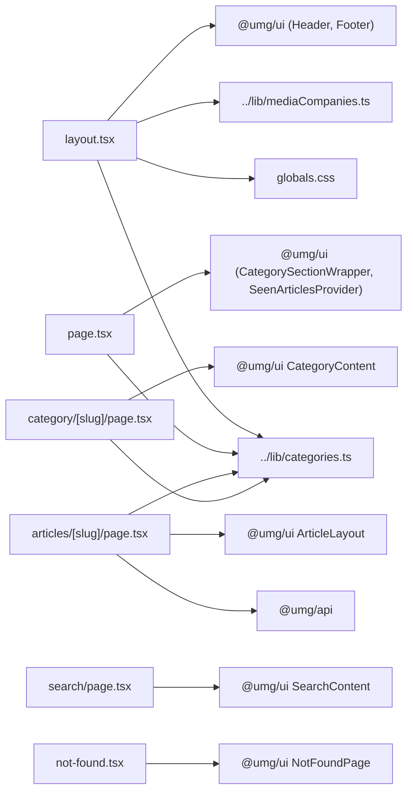

# apps/international-spectrum/app — overview

Next.js App Router tree for the International Spectrum site. The pages here are deliberately thin: layout and homepage wire local site config (7 categories, media companies, branding) into shared `@umg/ui` components, and each route delegates rendering to a shared component.

## Contents
| Item | Type | Summary |
|------|------|---------|
| [layout.tsx](layout.tsx.md) | file | Root layout — Geist fonts, site metadata, shared Header/Footer with International Spectrum branding. |
| [page.tsx](page.tsx.md) | file | Homepage — one `CategorySectionWrapper` per category (all five section types incl. `type4`/`type4-text`), with cross-section dedup. |
| [globals.css](globals.css.md) | file | Tailwind v4 CSS-first config, IS theme variables (yellow `#feb70c` accent, light purple footer), marquee animation. |
| [not-found.tsx](not-found.tsx.md) | file | 404 boundary — re-exports `NotFoundPage` from `@umg/ui`. |
| [about-us/](about-us/README.md) | folder | Static About Us page (culture/lifestyle positioning + contact). |
| [articles/[slug]/](articles/[slug]/README.md) | folder | Statically generated article detail pages, with YouTube embed support. |
| [category/[slug]/](category/[slug]/README.md) | folder | Category archive pages (7 categories). |
| [search/](search/README.md) | folder | Search page wrapper around shared `SearchContent`. |
| icon.jpg | asset | Favicon (App Router file convention; no doc). |

## Connections

## Entry points
- `/` — homepage (7 category sections)
- `/about-us/` — static About Us
- `/articles/<slug>/` — article detail (static, per WP post; video embed when `video_url` set)
- `/category/<slug>/` — category archives (7 categories)
- `/search/` — full-text search (`?search=` query)
- 404 — any other URL or `notFound()` call

---
*Documented at commit 1cbdce5.*
