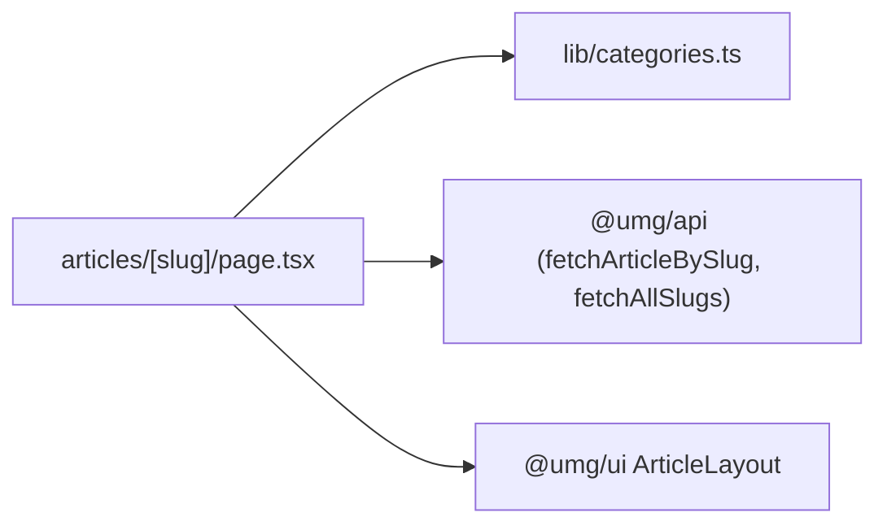

# apps/international-spectrum/app/articles/[slug] — overview

Article detail route — pre-renders every WordPress post at build time and displays it via the shared `ArticleLayout` (gallery or YouTube embed, prose body, comments, "More Articles" carousel).

## Contents
| Item | Type | Summary |
|------|------|---------|
| [page.tsx](page.tsx.md) | file | `generateStaticParams` from `fetchAllSlugs()`; per-article OG/Twitter metadata; renders `ArticleLayout` with category color map and `videoUrl` (YouTube embeds for Video Interviews). |

## Connections

## Entry points
- Route: `/articles/<slug>/` — one static page per WP post slug; unknown slugs 404 (`dynamicParams = false`).

---
*Documented at commit 1cbdce5.*
