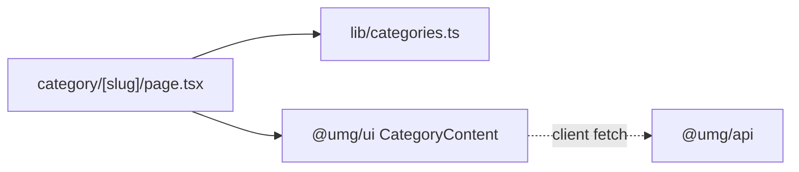

# apps/international-spectrum/app/category/[slug] — overview

Category archive route — one statically generated page per local category (7 for International Spectrum); listing, pagination, and states are handled client-side by the shared `CategoryContent`.

## Contents
| Item | Type | Summary |
|------|------|---------|
| [page.tsx](page.tsx.md) | file | Static params from `lib/categories`; sets `<Category> | International Spectrum` title; renders `CategoryContent`. |

## Connections

## Entry points
- Routes: `/category/<slug>/` for `communitypublicprograms`, `civicandculturalaffairs`, `arts`, `historylegacy`, `socialimpactjustice`, `leadershipyouthengagement`, `video-interviews`.

---
*Documented at commit 1cbdce5.*
