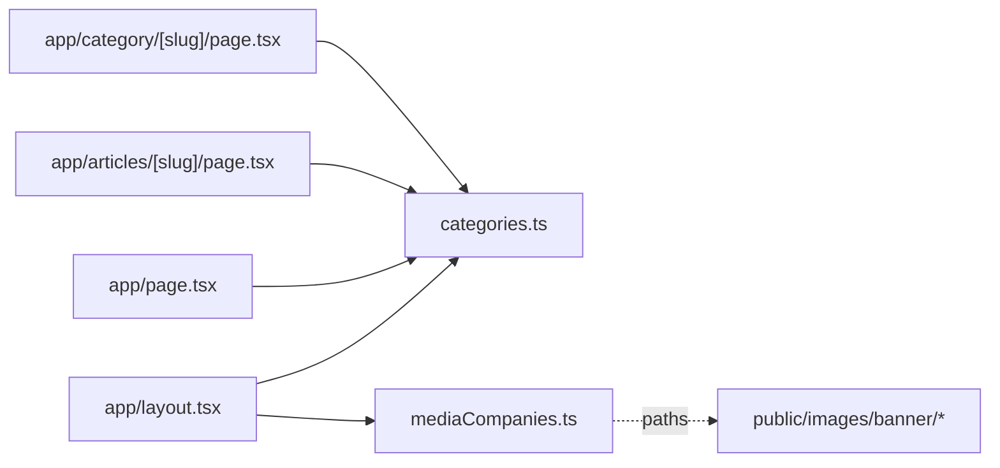

# apps/international-spectrum/lib — overview

International Spectrum's per-site configuration: the category taxonomy and the sibling-brand list. These two files are where this app most visibly diverges from echo-media — the page/component code is otherwise near-identical between the two sites.

## Contents
| Item | Type | Summary |
|------|------|---------|
| [categories.ts](categories.ts.md) | file | 7 categories across 4 accent colors, with responsive Header nav split (2 main / 2 lg-only / 3 in "More") and Footer columns. |
| [mediaCompanies.ts](mediaCompanies.ts.md) | file | 3 cross-promoted brands (UMG, Echo Media, Diplomatic Watch) with local banner logo paths. |

## Connections

## Entry points
- Not routed; imported by the `app/` pages (via the `@/lib/...` alias in layout/home, relative paths elsewhere). Category slugs must mirror the WordPress backend taxonomy.

---
*Documented at commit 1cbdce5.*
