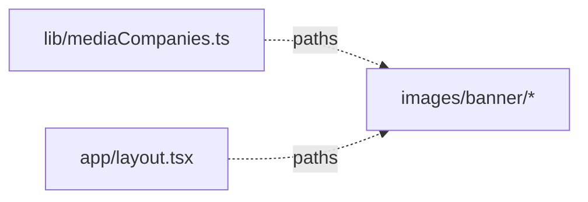

# apps/international-spectrum/public — overview

Static assets served from the site root. Currently holds only the localized banner logo set; the favicon lives in `app/icon.jpg` (App Router convention), not here.

## Contents
| Item | Type | Summary |
|------|------|---------|
| [images/banner/](images/banner/README.md) | folder | Brand logos for the Header marquee and Footer: 3 brands (this site + 2 siblings) × color/B&W, 8 files counting the UMG masthead's legacy PNG copies. |

## Connections

## Entry points
- Served at `/<path>` (e.g. `/images/banner/is-logo.svg`); copied verbatim into `out/` by the static export.

---
*Documented at commit 0c47b38.*
