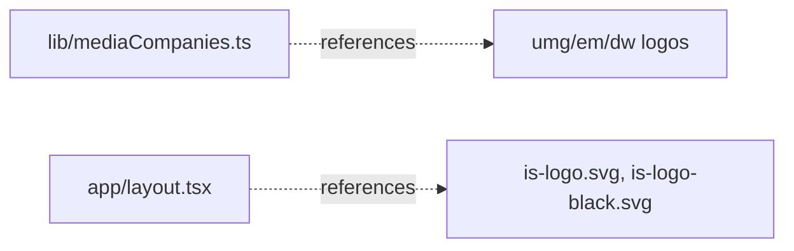

# apps/international-spectrum/public/images/banner — overview

Local marquee/footer logo assets for the United Media brand banner. Four companies × two variants (color for the Header marquee, B&W for the Footer) = 8 files. Previously served from WordPress uploads, now fully local.

## Contents
| Item | Type | Summary |
|------|------|---------|
| is-logo.svg | asset | International Spectrum color logo — this site's own Header logo (`layout.tsx`). |
| is-logo-black.svg | asset | International Spectrum B&W logo — this site's own Footer logo. |
| umg-masthead.svg / umg-masthead.png | asset | United Media Group color masthead (SVG referenced by `mediaCompanies.ts`; PNG legacy copy). |
| umg-masthead-black.svg / umg-masthead-black.png | asset | UMG B&W masthead (SVG referenced; PNG legacy copy). |
| em-logo.svg | asset | Echo Media color logo (marquee). |
| em-logo-black.png | asset | Echo Media B&W logo (footer; PNG due to original format). |
| dw-logo.png | asset | Diplomatic Watch color logo (marquee). |
| dw-logo-black.svg | asset | Diplomatic Watch B&W logo (footer). |

## Connections

## Entry points
- Served statically at `/images/banner/<file>`. To update a logo, replace the same-named file in **all three** app copies (echo-media, international-spectrum, umg).

---
*Documented at commit 1cbdce5.*
