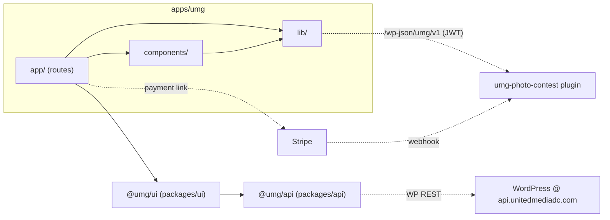

# apps/umg/ — overview

The main United Media Group site: a statically exported Next.js 16 app that (1) aggregates news from the three UMG media companies via shared `@umg/ui` components and the headless WordPress backend, and (2) hosts the "My Hometown, My Lens" international youth photography competition — landing page, judges panel, and an authenticated submission flow with email-OTP login, server-side drafts, and Stripe payment.

## Contents
| Item | Type | Summary |
|------|------|---------|
| [app/](app/README.md) | folder | App Router routes: home, category, search, about-us, contact, 404 + the three competition routes; plus sitemap.xml/robots.txt and per-page metadata + JSON-LD (AEO). |
| [components/](components/README.md) | folder | Competition presentational components (divisions, requirements, rules, committees). |
| [lib/](lib/README.md) | folder | Categories/media-company data, competition config-as-code, auth context + REST client. |
| [fonts/](fonts/README.md) | folder | Local font binaries (ABC Arizona Sans trial, Author variable). |
| [public/](public/README.md) | folder | Logos, banner/judge/venue/sponsor images. |
| [package.json](package.json.md) | file | Manifest; depends on `@umg/api`, `@umg/config`, `@umg/ui`. |
| [next.config.ts](next.config.ts.md) | file | Static export (`output: "export"`), unoptimized images, remote-host allowlist. |
| [tsconfig.json](tsconfig.json.md) | file | Strict TS config with `@/*` alias. |
| [eslint.config.mjs](eslint.config.mjs.md) | file | eslint-config-next flat config; `no-img-element` off. |
| [postcss.config.mjs](postcss.config.mjs.md) | file | Tailwind 4 PostCSS plugin. |

## Connections

Cross-tree docs: shared UI at [../../packages/ui/](../../packages/ui/README.md) (Header, Footer, CategoryContent, SearchContent, sections), API client at [../../packages/api/client.ts.md](../../packages/api/client.ts.md), WP plugin at [../../plugin/umg-photo-contest/](../../plugin/umg-photo-contest/umg-photo-contest.php.md).

## Entry points
- **News + info routes:** `/` (per-category sections), `/category/<slug>` (×8, statically generated), `/search`, `/about-us`, `/contact` — article data fetched client-side from the WP REST API via `@umg/ui` + `@umg/api`, with `externalOnly` links out to the source publications.
- **AEO:** Organization JSON-LD in the layout; Event + FAQPage schema on `/how-to-enter`; FAQPage on `/about-us`; ContactPage on `/contact`; per-page OpenGraph/Twitter metadata; `/sitemap.xml` and `/robots.txt` (named AI crawlers).
- **Competition routes:** `/how-to-enter` (brochure from [lib/competitions/current.ts](lib/competitions/current.ts.md)), `/judges-panel` (bios + hash anchors), `/photo-submission` (OTP sign-in → autosaved draft → submit → $50 Stripe payment, status polled via `GET /me`). Backend is the umg-photo-contest WP plugin at `/wp-json/umg/v1/`.
- **Build:** `pnpm dev` / `pnpm build` (static export to `out/`); `NEXT_PUBLIC_WP_API_URL` selects the WP backend at build time.

---
*Documented at commit 60deaa3.*
