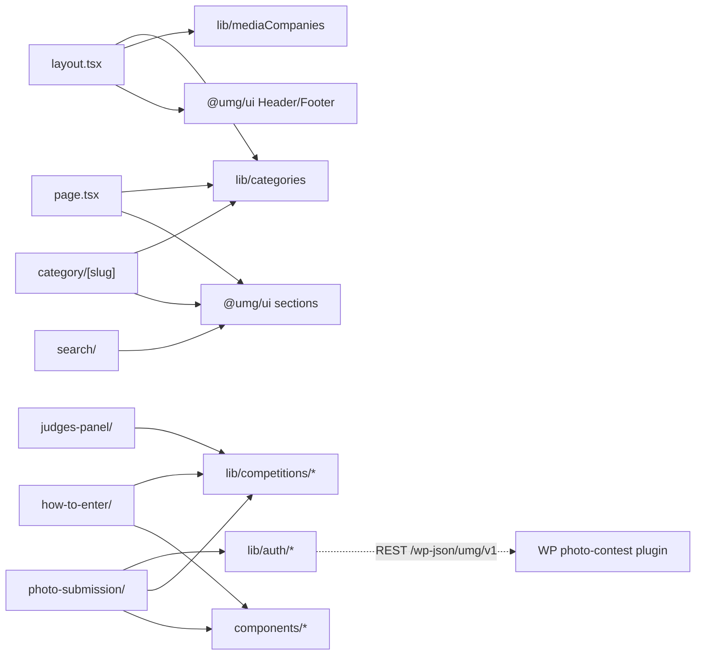

# app/ — overview

Next.js App Router tree for the UMG site. The root layout supplies fonts and the shared Header/Footer; news routes (`/`, `/category/*`, `/search`) are thin wrappers over `@umg/ui` aggregator components, while the competition routes (`/how-to-enter`, `/judges-panel`, `/photo-submission`) are app-specific.

## Contents
| Item | Type | Summary |
|------|------|---------|
| [layout.tsx](layout.tsx.md) | file | Root layout: fonts, metadata, `@umg/ui` Header/Footer wired to categories, media companies, socials, and the competition banner. |
| [page.tsx](page.tsx.md) | file | Homepage: one `CategorySectionWrapper` per category, deduped via SeenArticlesProvider. |
| [globals.css](globals.css.md) | file | Tailwind 4 entry, `@source` scan of packages/ui, marquee animation, brand color variables. |
| [not-found.tsx](not-found.tsx.md) | file | Re-exports the shared 404 page. |
| [about-us/](about-us/README.md) | folder | Static About Us page. |
| [category/](category/README.md) | folder | Statically generated `/category/[slug]` listing pages. |
| [how-to-enter/](how-to-enter/README.md) | folder | Photo-competition landing page. |
| [judges-panel/](judges-panel/README.md) | folder | Judge bios with hash-anchor scrolling. |
| [photo-submission/](photo-submission/README.md) | folder | Authenticated entry flow (sign-in → submit → pay). |
| [search/](search/README.md) | folder | Search route (shared UI). |
| icon.svg, old-icon.png | assets | Favicon/app icon files (App Router metadata convention); not documented individually. |

## Connections

## Entry points
Routes: `/`, `/about-us`, `/category/<slug>` (×8), `/search`, `/how-to-enter`, `/judges-panel`, `/photo-submission`, plus the 404 page. All are statically exported (`output: "export"`).

---
*Documented at commit 1cbdce5.*
