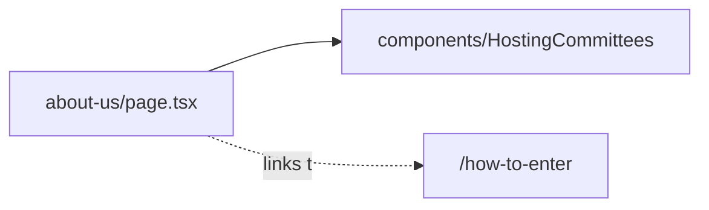

# app/about-us/ — overview

Route segment for `/about-us` — a static page about United Media Group, its three platforms, values, partners, and contact channels.

## Contents
| Item | Type | Summary |
|------|------|---------|
| [page.tsx](page.tsx.md) | file | Seven-section About Us page; all copy hardcoded, reuses HostingCommittees as "Our Partners". |

## Connections

## Entry points
- Route: `/about-us` (linked from Header/Footer nav).

---
*Documented at commit 1cbdce5.*
