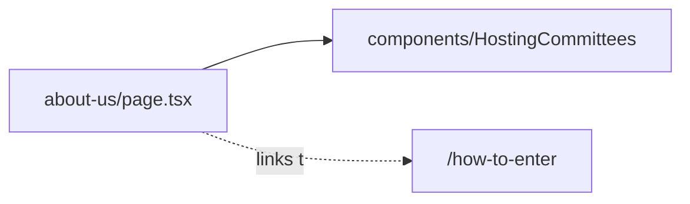

# app/about-us/ — overview

Route segment for `/about-us` — a static page about United Media Group, its two platforms, values, partners, FAQ, and contact channels.

## Contents
| Item | Type | Summary |
|------|------|---------|
| [page.tsx](page.tsx.md) | file | Seven-section About Us page; all copy hardcoded, reuses HostingCommittees as "Our Partners", emits FAQPage JSON-LD from the same `faqs` array it renders. |

## Connections

```mermaid
graph LR
  page["about-us/page.tsx"] --> HC["components/HostingCommittees"]
  page -.links to.-> HTE["/how-to-enter"]
```

## Entry points
- Route: `/about-us` (linked from Header/Footer nav).

## Status
- The "My Hometown, My Lens" competition promo section (Section 4) is commented out in [page.tsx](page.tsx.md) while the competition is postponed (2026-08-13); grep "Competition postponed indefinitely" to restore.
- Diplomatic Watch was dropped at the client's request (2026-10-01, `0c47b38`): its card was deleted from the `platforms` array, so "Our Platforms" now renders **two** pillars (Echo Media, International Spectrum), and the page metadata description, the "What does United Media Group cover?" FAQ answer ("three pillars" → "two pillars") and the "Who We Are" body copy no longer name it. The platforms grid was left on `md:grid-cols-3`, which stranded the two cards in columns 1 and 2 with an empty third; fixed to `md:grid-cols-2` in `11f39b4`.

---
*Documented at commit 11f39b4.*
