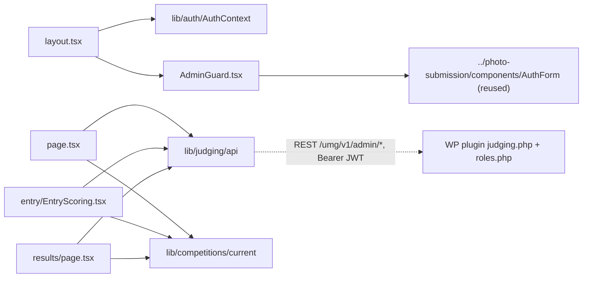

# app/admin/ — overview

Route segment for `/admin` — the **judge panel / judging dashboard** (v1 shipped 2026-07-04, parked pending client UX feedback). Judges sign in with the same passwordless email code as entrants, browse submitted entries (blind by default), score each against the competition criteria, and admins see aggregated per-division rankings. Deliberately **left live** when the public competition pages were hidden on 2026-08-13.

## Contents
| Item | Type | Summary |
|------|------|---------|
| [layout.tsx](layout.tsx.md) | file | `AuthProvider` + `AdminGuard` around every `/admin/*` route; `robots: noindex`. |
| [AdminGuard.tsx](AdminGuard.tsx.md) | file | Client gate: sign-in form / "Not authorized" (no `is_judge`) / children. UX only — the plugin enforces capabilities. |
| [page.tsx](page.tsx.md) | file | Dashboard grid of submitted entries with the judge's own status badge; division + status filters; Results link for admins. |
| [entry/](entry/README.md) | folder | `/admin/entry?id=` — view one entry and score it (draft/final). |
| [results/page.tsx](results/page.tsx.md) | file | `/admin/results` — admin-only per-division ranking tables (avg total, judge counts). |

## Connections

## Entry points
- Route: `/admin` (not in site nav or sitemap; `noindex`). Flow: AuthForm → `AdminGuard` checks `user.is_judge` → dashboard → `/admin/entry/?id=<n>` to score → admins additionally get `/admin/results/`.
- Roles come from the plugin: capabilities `umgpc_judge_submissions` (judge) and `umgpc_admin_results` (admin) surface as `is_judge` / `is_admin` on the `/me` `User` ([lib/auth/types.ts](../../lib/auth/types.ts.md)). Blind judging is a WP option (`umgpc_blind_judging`, default on): when on, non-admins never receive `identity` (name/school/grade/recommender).

## Notes
- All authorization is server-side; every frontend check here is a convenience.
- Client-side status filter and no pagination UI — fine at current entry volumes.
- Status/open questions: `claude-context/paused-work/judge-panel-parked.md`. Backend files: [judging.php](../../../../plugin/umg-photo-contest/includes/judging.php.md), [roles.php](../../../../plugin/umg-photo-contest/includes/roles.php.md), [entry-state.php](../../../../plugin/umg-photo-contest/includes/entry-state.php.md).

---
*Documented at commit bde729d.*
