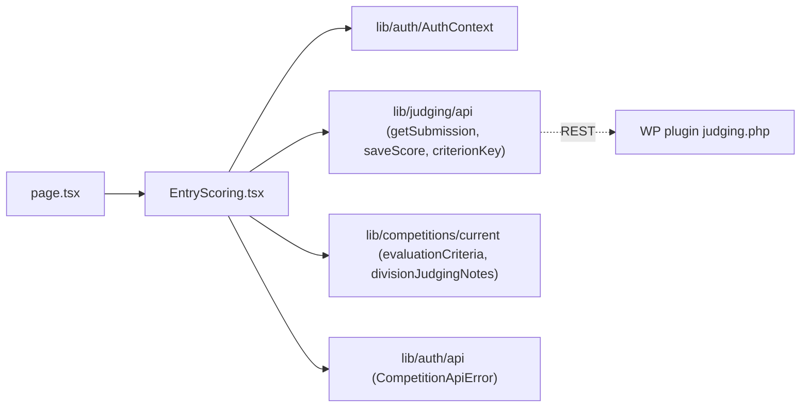

# app/admin/entry/ — overview

The `/admin/entry?id=<n>` route: a static-export-friendly `Suspense` shell plus the client component where a judge views one submitted entry and scores it (draft → final).

## Contents
| Item | Type | Summary |
|------|------|---------|
| [page.tsx](page.tsx.md) | file | Route shell — `Suspense` around `EntryScoring` (required for `useSearchParams` under static export). |
| [EntryScoring.tsx](EntryScoring.tsx.md) | file | Loads the entry, shows photos/bio/(recommender), 1–10 per-criterion scoring form with Save draft / Submit final; locks when final. |

## Connections

## Entry points
- Route: `/admin/entry/?id=<n>` — reached from the dashboard grid ([../page.tsx](../page.tsx.md)) and the results table ([../results/page.tsx](../results/page.tsx.md)); gated by [../AdminGuard.tsx](../AdminGuard.tsx.md) via the segment layout.
- `?id=` addressing is a static-export workaround; migrate to `/admin/entry/[id]` once there is a server runtime.

---
*Documented at commit bde729d.*
