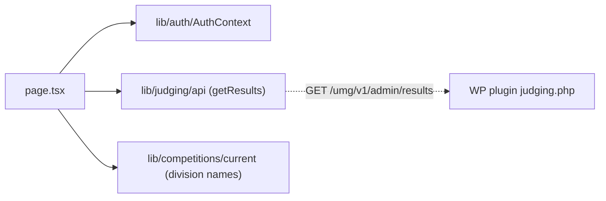

# app/admin/results/ — overview

The `/admin/results` route — admin-only aggregated rankings across judges' final scores, grouped by division.

## Contents
| Item | Type | Summary |
|------|------|---------|
| [page.tsx](page.tsx.md) | file | Second-level `is_admin` check, then per-division tables (rank, entry link, entrant, avg total, judge/final counts). |

## Connections

## Entry points
- Route: `/admin/results/` — linked from the dashboard header ([../page.tsx](../page.tsx.md)) only for `user.is_admin`; gated by [../AdminGuard.tsx](../AdminGuard.tsx.md) plus its own admin check.

---
*Documented at commit bde729d.*
