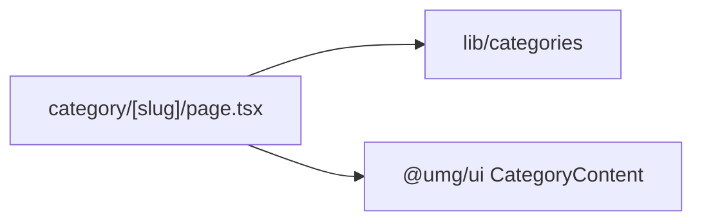

# app/category/[slug]/ — overview

Dynamic route segment that statically generates one listing page per category (8 pages, `dynamicParams = false`).

## Contents
| Item | Type | Summary |
|------|------|---------|
| [page.tsx](page.tsx.md) | file | Per-category page; static params from `lib/categories`, body delegated to `@umg/ui` CategoryContent (`externalOnly`). |

## Connections

## Entry points
- Routes: `/category/<slug>` for each of the 8 slugs in [lib/categories](../../../lib/categories.ts.md) (e.g. `/category/diplomacy/`).

---
*Documented at commit 1cbdce5.*
