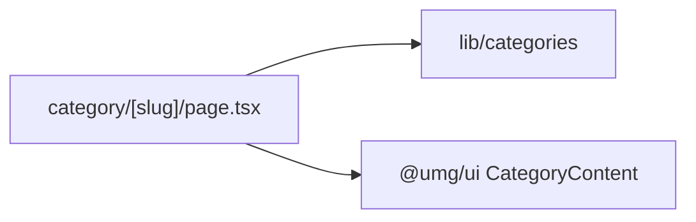

# app/category/[slug]/ — overview

Dynamic route segment that statically generates one listing page per category (9 pages — the 8 nav categories + Video Interviews, `dynamicParams = false`).

## Contents
| Item | Type | Summary |
|------|------|---------|
| [page.tsx](page.tsx.md) | file | Per-category page; static params from `pageCategories` in `lib/categories`, body delegated to `@umg/ui` CategoryContent (`externalOnly`). |

## Connections

```mermaid
graph LR
  page["category/[slug]/page.tsx"] --> cats["lib/categories"]
  page --> CC["@umg/ui CategoryContent"]
```

## Entry points
- Routes: `/category/<slug>` for each of the 9 slugs in `pageCategories` from [lib/categories](../../../lib/categories.ts.md) (e.g. `/category/diplomacy/`, `/category/video-interviews/`).

---
*Documented at commit 2354375.*
