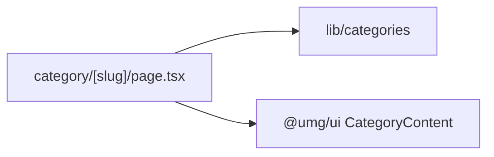

# app/category/[slug]/ — overview

Dynamic route segment that statically generates one listing page per category (9 pages — the 8 nav categories + Video Interviews, `dynamicParams = false`).

## Contents
| Item | Type | Summary |
|------|------|---------|
| [page.tsx](page.tsx.md) | file | Per-category page; static params from `pageCategories` in `lib/categories`, metadata from the matching entry, body delegated to `@umg/ui` CategoryContent (`externalOnly`). |

## Connections

```mermaid
graph LR
  page["category/[slug]/page.tsx"] --> cats["lib/categories"]
  page --> CC["@umg/ui CategoryContent"]
```

## Entry points
- Routes: `/category/<slug>` for each of the 9 slugs in `pageCategories` from [lib/categories](../../../lib/categories.ts.md) (e.g. `/category/diplomacy/`, `/category/video-interviews/`).

## Four of these pages are intentionally empty
Diplomatic Watch was dropped as a source at the client's request (2026-10-01, `0c47b38`). It was 92.4% of UMG's ingested articles (2,597 of 2,811; 215 remain), which left four nav categories — World News & Politics, Economy & Business, Diplomacy, and Wellbeing/Environment/Technology — with **zero** articles.

The header, footer and homepage sections are filtered down to the populated categories at build time by [lib/activeCategories.ts](../../../lib/activeCategories.ts.md), but this route deliberately keeps using the **unfiltered** `pageCategories`, so all 9 pages are still generated and existing inbound links resolve to CategoryContent's graceful "No articles found in this category." rather than a 404. `generateStaticParams` and `dynamicParams = false` are unchanged.

The page metadata description also no longer names Diplomatic Watch — it now reads `<name> coverage from United Media Group's pillars: Echo Media and International Spectrum.`

---
*Documented at commit 6e04fee.*
