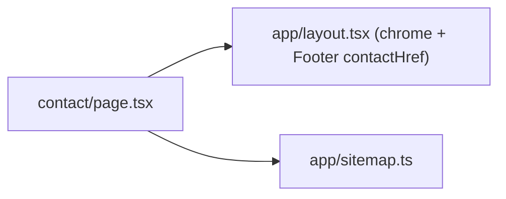

# contact/ — overview

The `/contact` route: a static contact page with a ContactPage JSON-LD entity. Added as part of the AEO work (entity-verification + a basic user-expected page).

## Contents
| Item | Type | Summary |
|------|------|---------|
| [page.tsx](page.tsx.md) | file | Contact details (branded email, socials with `rel="me"`, location) + ContactPage schema + metadata. |

## Connections

## Entry points
Route `/contact`, reached from the Footer "Contact Us" link (layout passes `contactHref="/contact"`).

---
*Documented at commit 60deaa3.*
