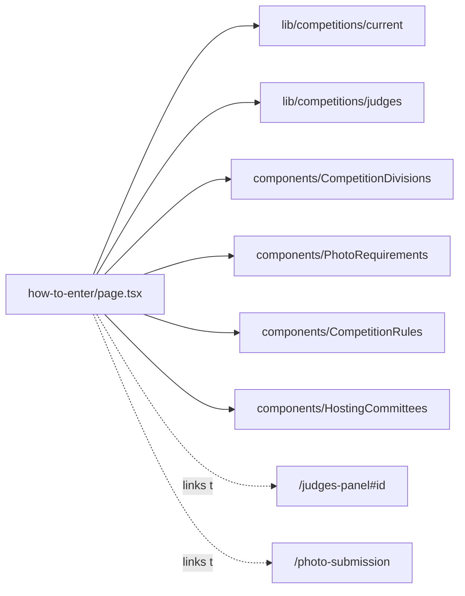

# app/how-to-enter/ — overview

Route segment for `/how-to-enter` — the public landing/brochure page for the "My Hometown, My Lens" photo competition.

## Contents
| Item | Type | Summary |
|------|------|---------|
| [page.tsx](page.tsx.md) | file | Full competition brochure: theme, timeline, divisions, requirements, awards, venues, criteria, judges grid, CTA to `/photo-submission`, rules, committees. |

## Connections

## Entry points
- Route: `/how-to-enter` — promoted site-wide via the Header announcement banner and extra nav link set in [app/layout.tsx](../layout.tsx.md).

---
*Documented at commit 1cbdce5.*
