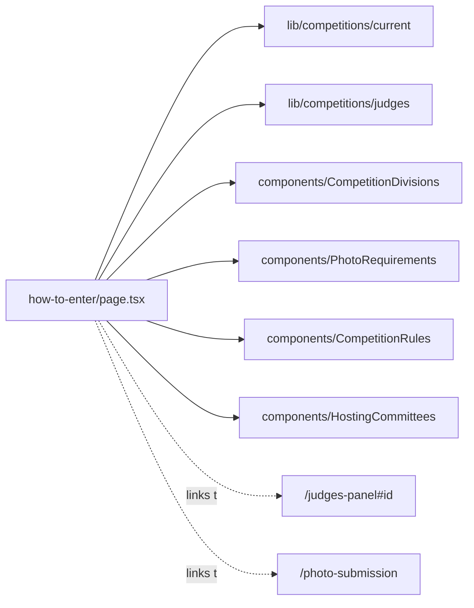

# app/how-to-enter/ — overview

Route segment for `/how-to-enter` — the public landing/brochure page for the "My Hometown, My Lens" photo competition.

## Contents
| Item | Type | Summary |
|------|------|---------|
| [page.tsx](page.tsx.md) | file | On-hold announcement (current mode, behind `COMPETITION_ON_HOLD`) / full competition brochure: theme, timeline, divisions, requirements, awards, venues, criteria, judges grid, CTA to `/photo-submission`, rules, committees. |

## Connections

```mermaid
graph LR
  page["how-to-enter/page.tsx"] --> current["lib/competitions/current"]
  page --> judges["lib/competitions/judges"]
  page --> CD["components/CompetitionDivisions"]
  page --> PR["components/PhotoRequirements"]
  page --> CR["components/CompetitionRules"]
  page --> HC["components/HostingCommittees"]
  page -.links to.-> JP["/judges-panel#id"]
  page -.links to.-> PS["/photo-submission"]
```

## Entry points
- Route: `/how-to-enter` — promoted site-wide via the Header announcement banner set in [app/layout.tsx](../layout.tsx.md) ("My Hometown My Lens Competition Update"); the competition-era extra nav link is still commented out, as is the "Apply as a school" link path.

## Status
**Competition postponed indefinitely (client request, 2026-08-13):** since 2026-08-23 this route renders an on-hold announcement (refunds for all applicants, contact info@unitedmediadc.com) instead of a 404, gated by a `COMPETITION_ON_HOLD` flag in [page.tsx](page.tsx.md); it is back in the sitemap and linked from the Header banner. Set the flag to false (grep "Competition postponed indefinitely") to restore the full brochure.

---
*Documented at commit b9a61ff.*
