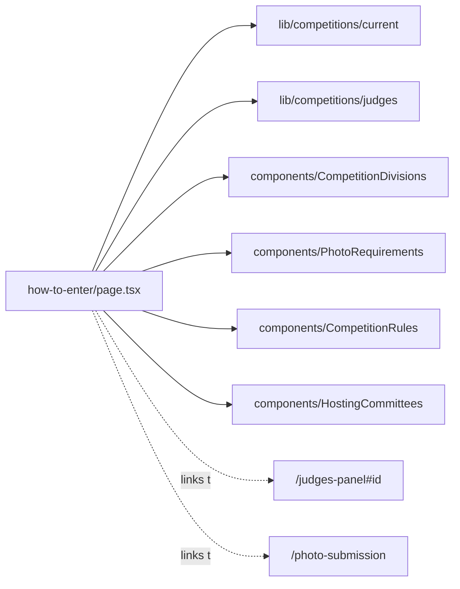

# app/how-to-enter/ — overview

Route segment for `/how-to-enter` — the public landing/brochure page for the "My Hometown, My Lens" photo competition.

## Contents
| Item | Type | Summary |
|------|------|---------|
| [page.tsx](page.tsx.md) | file | Full competition brochure: theme, timeline, divisions, requirements, awards, venues, criteria, judges grid, CTA to `/photo-submission`, rules, committees. |

## Connections

```mermaid
graph LR
  page["how-to-enter/page.tsx"] --> current["lib/competitions/current"]
  page --> judges["lib/competitions/judges"]
  page --> CD["components/CompetitionDivisions"]
  page --> PR["components/PhotoRequirements"]
  page --> CR["components/CompetitionRules"]
  page --> HC["components/HostingCommittees"]
  page -.links to.-> JP["/judges-panel#id"]
  page -.links to.-> PS["/photo-submission"]
```

## Entry points
- Route: `/how-to-enter` — when live, promoted site-wide via the Header announcement banner and extra nav link set in [app/layout.tsx](../layout.tsx.md) (both currently commented out); also the "Apply as a school" link to `/school-registration`.

## Status
**Competition postponed indefinitely (client request, 2026-08-13):** the page component calls `notFound()` first, so this route currently renders the 404 page; the sitemap entry and inbound links are commented out. Delete the guard line (grep "Competition postponed indefinitely") to restore.

---
*Documented at commit bde729d.*
