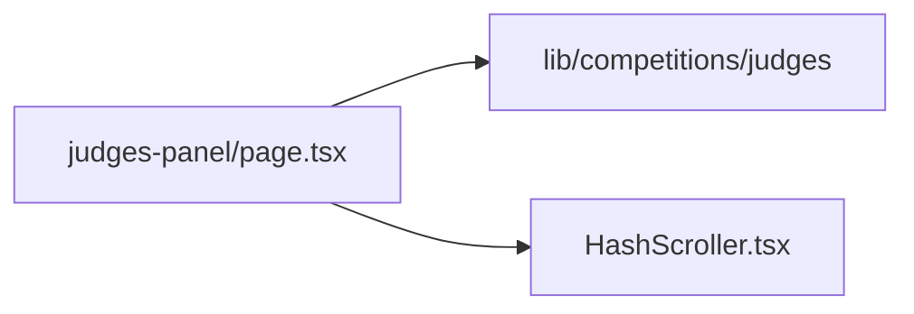

# app/judges-panel/ — overview

Route segment for `/judges-panel` — full-bio cards for the 15 competition judges, with hash-anchor deep linking.

## Contents
| Item | Type | Summary |
|------|------|---------|
| [page.tsx](page.tsx.md) | file | Hero banner + judge card grid; each card anchored by `id={judge.id}`. |
| [HashScroller.tsx](HashScroller.tsx.md) | file | Client no-render helper that smooth-scrolls to `location.hash` after hydration. |

## Connections

## Entry points
- Route: `/judges-panel` (plus `#<judge-id>` anchors, linked from the how-to-enter judges grid).

---
*Documented at commit 1cbdce5.*
