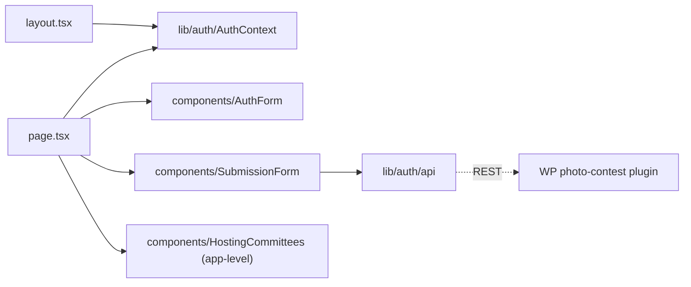

# app/photo-submission/ — overview

Route segment for `/photo-submission` — the competition entry flow: sign in (email OTP) → fill/submit the entry → pay via Stripe. The only authenticated part of the site; the segment layout mounts the AuthProvider.

## Contents
| Item | Type | Summary |
|------|------|---------|
| [layout.tsx](layout.tsx.md) | file | Wraps the segment in `AuthProvider` (token restore scoped to this route). |
| [page.tsx](page.tsx.md) | file | Client orchestrator: step indicator + switches AuthForm ↔ SubmissionForm. |
| [components/](components/README.md) | folder | AuthForm (OTP sign-in) and SubmissionForm (entry + payment). |

## Connections

## Entry points
- Route: `/photo-submission` — reached from the "Apply Now" CTA on `/how-to-enter`.
- Flow: AuthForm (request/verify code) → SubmissionForm draft (autosaved server-side) → `POST /submit` → Stripe payment link → webhook flips `payment_status` → polling shows the completed view.

---
*Documented at commit 1cbdce5.*
