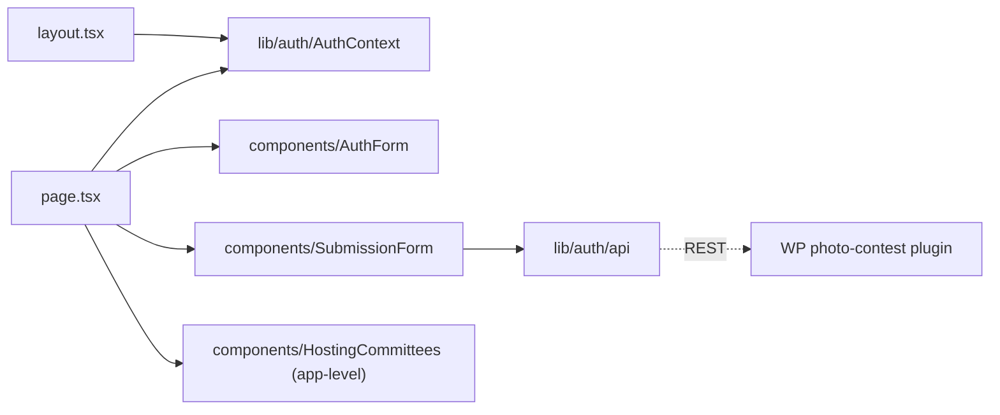

# app/photo-submission/ — overview

Route segment for `/photo-submission` — the competition entry flow: sign in (email OTP) → fill/submit the entry → pay via Stripe. One of three authenticated segments (with `/school-registration` and `/admin`), each mounting its own `AuthProvider`.

## Contents
| Item | Type | Summary |
|------|------|---------|
| [layout.tsx](layout.tsx.md) | file | Wraps the segment in `AuthProvider` (token restore scoped to this route); metadata commented out while hidden. |
| [page.tsx](page.tsx.md) | file | Client orchestrator: step indicator + switches AuthForm ↔ SubmissionForm. |
| [components/](components/README.md) | folder | AuthForm (OTP sign-in) and SubmissionForm (entry + payment). |

## Connections

```mermaid
graph LR
  layout["layout.tsx"] --> AC["lib/auth/AuthContext"]
  page["page.tsx"] --> AC
  page --> AF["components/AuthForm"]
  page --> SF["components/SubmissionForm"]
  page --> HC["components/HostingCommittees (app-level)"]
  SF --> API["lib/auth/api"]
  API -.REST.-> WP["WP photo-contest plugin"]
```

## Entry points
- Route: `/photo-submission` — reached from the "Apply Now" CTA on `/how-to-enter`.
- Flow: AuthForm (request/verify code) → SubmissionForm draft (autosaved server-side) → `POST /submit` → Stripe payment link (with a "Back to edit" → `POST /unsubmit` escape hatch until paid) → webhook flips `payment_status` → polling shows the completed view.

## Status
**Competition postponed indefinitely (client request, 2026-08-13):** [page.tsx](page.tsx.md) calls `notFound()` first, so this route currently renders the 404 page; the sitemap entry and inbound links are commented out. Delete the guard line (grep "Competition postponed indefinitely") to restore.

---
*Documented at commit bde729d.*
