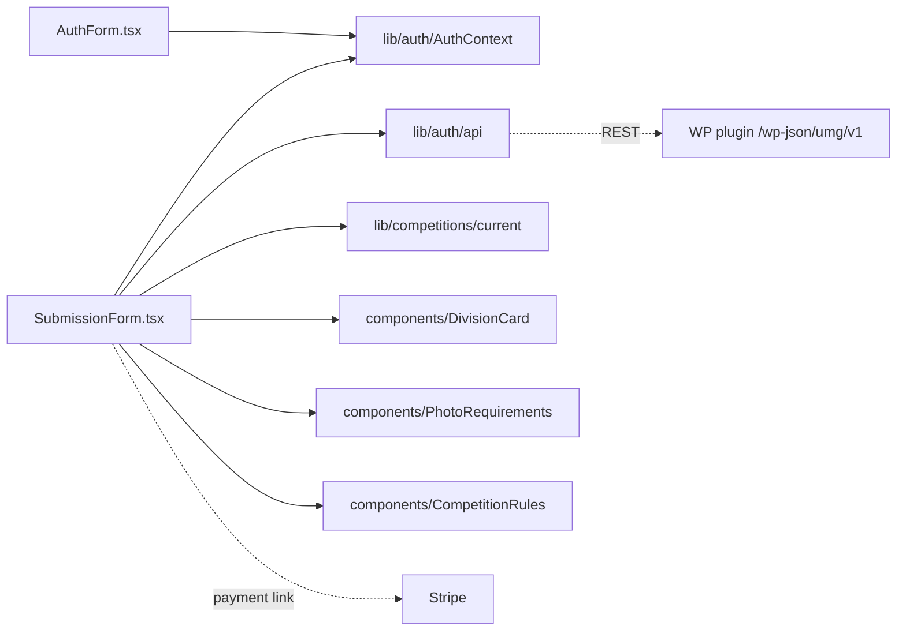

# app/photo-submission/components/ — overview

Client components private to the `/photo-submission` route: the passwordless sign-in form and the main entry form.

## Contents
| Item | Type | Summary |
|------|------|---------|
| [AuthForm.tsx](AuthForm.tsx.md) | file | Email → 6-digit OTP verification; drives `requestCode`/`verifyCode` from the auth context. |
| [SubmissionForm.tsx](SubmissionForm.tsx.md) | file | The full entry form: draft autosave, photo + student-proof uploads, consents, submit, Stripe payment view with status polling, read-only completed view. |

## Connections

## Entry points
Not routed directly — both are rendered by [../page.tsx](../page.tsx.md) depending on auth state.

---
*Documented at commit 1cbdce5.*
