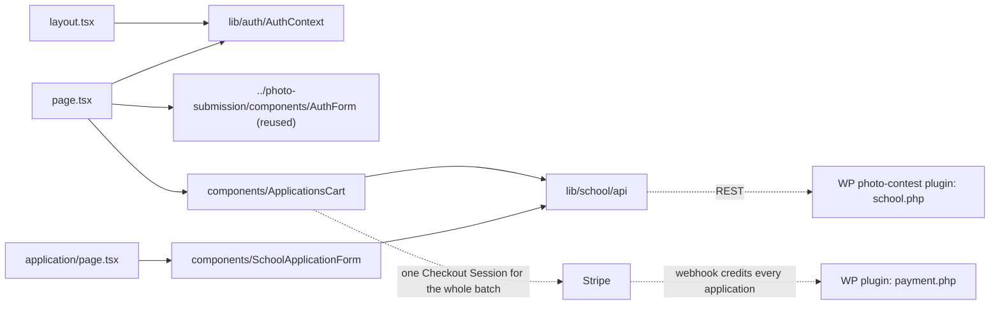

# app/school-registration/ — overview

Route segment for `/school-registration` — the school/bulk-registration flow: sign in (same passwordless email code as the individual flow) → manage a batch of student applications one at a time → pay once for the whole batch via a single Stripe Checkout Session. **Feature complete and live-verified**, including a real payment that credited two applications from one checkout.

## Contents
| Item | Type | Summary |
|------|------|---------|
| [layout.tsx](layout.tsx.md) | file | Wraps the segment in `AuthProvider` (reused from the individual flow). |
| [page.tsx](page.tsx.md) | file | Sign-in or `ApplicationsCart`, depending on auth state. |
| [application/](application/README.md) | folder | Per-application create/edit/view route, addressed by `?id=`. |
| [components/](components/README.md) | folder | `ApplicationsCart` (batch manager + combined payment) and `SchoolApplicationForm` (per-student entry). |

## Connections

## Entry points
- Route: `/school-registration` — reached from a secondary "Apply as a school" link on `/how-to-enter`.
- Flow: AuthForm (reused, no school-specific auth) → `ApplicationsCart` (create/edit/delete applications one at a time via `SchoolApplicationForm`) → once one or more are submitted, "Pay $Z total (N students)" → one Stripe Checkout Session → webhook credits every covered application from that single event → cart polls and reflects `paid`.
- `application/?id=<n>` is not linked externally — only reached via the cart's own edit/view/add-another actions.

## Notes
- Built additively alongside the pre-existing individual `/photo-submission` flow — no shared code was modified except one narrow exclusion filter in the plugin's `umgpc_find_draft_id()` (see `docs/codebase/plugin/umg-photo-contest/includes/draft.php.md`).
- An earlier plan for the payment step used N separate individual-flow Payment Link payments (one per student) — rejected mid-build because it didn't deliver "one payment for the batch," the actual point of the feature. See `claude-context/current-work/bulk-registration/school-bulk-registration-plan.md` for the full history.
- Full build/test log, including the real end-to-end payment verification: `claude-context/current-work/bulk-registration/implementation-checklist.md`.

---
*Documented at commit e5821d4.*
