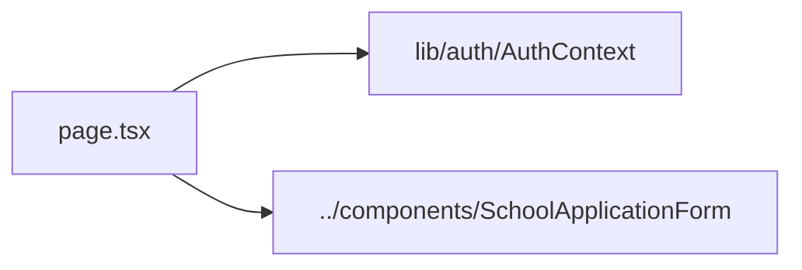

# app/school-registration/application/ — overview

Route segment for `/school-registration/application` — a single school application's create/edit/view page, addressed by `?id=`.

## Contents
| Item | Type | Summary |
|------|------|---------|
| [page.tsx](page.tsx.md) | file | Resolves `?id=`, guards auth, renders `SchoolApplicationForm` for that application. |

## Connections

## Entry points
Not linked directly — reached only via [../components/ApplicationsCart.tsx](../components/ApplicationsCart.tsx.md)'s per-application "Edit"/"View" links and its "Add another application" flow.

---
*Documented at commit e5821d4.*
