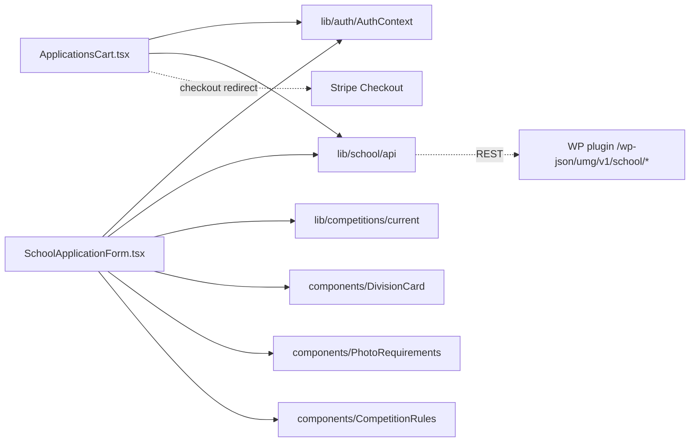

# app/school-registration/components/ — overview

Client components private to the `/school-registration` route: the batch manager (cart) and the per-application form.

## Contents
| Item | Type | Summary |
|------|------|---------|
| [ApplicationsCart.tsx](ApplicationsCart.tsx.md) | file | Lists the school's applications, add/delete, single "Pay $Z total" button covering the whole unpaid-submitted batch, status polling. |
| [SchoolApplicationForm.tsx](SchoolApplicationForm.tsx.md) | file | Create/edit/view a single application: student info, up to 3 photos, biography, consents, submit. |

## Connections

## Entry points
Not routed directly — `ApplicationsCart` is rendered by [../page.tsx](../page.tsx.md), `SchoolApplicationForm` by [../application/page.tsx](../application/page.tsx.md).

---
*Documented at commit e5821d4.*
