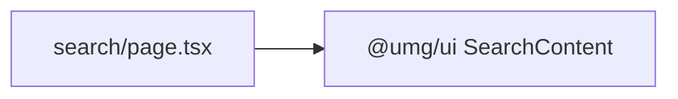

# app/search/ — overview

Route segment for `/search` — a one-line wrapper around the shared search UI.

## Contents
| Item | Type | Summary |
|------|------|---------|
| [page.tsx](page.tsx.md) | file | Renders `@umg/ui` SearchContent with `externalOnly`. |

## Connections

## Entry points
- Route: `/search` (Header search UI).

---
*Documented at commit 1cbdce5.*
