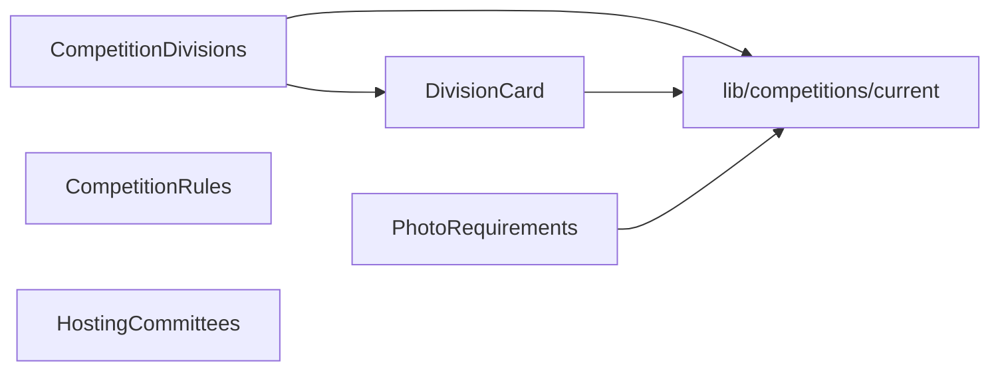

# components/ — overview

App-level presentational components, all related to the photo competition. Four of the five render content straight from the competition config; all are shared between the marketing page (`/how-to-enter`) and the submission flow.

## Contents
| Item | Type | Summary |
|------|------|---------|
| [CompetitionDivisions.tsx](CompetitionDivisions.tsx.md) | file | "Divisions" section — grid of DivisionCards for all divisions. |
| [DivisionCard.tsx](DivisionCard.tsx.md) | file | One division's fee, limits, requirements, and judging notes. |
| [PhotoRequirements.tsx](PhotoRequirements.tsx.md) | file | Format / color / resolution / size tiles + allowed devices. |
| [CompetitionRules.tsx](CompetitionRules.tsx.md) | file | Hardcoded official rules, terms & conditions (9 sections of legal text). |
| [HostingCommittees.tsx](HostingCommittees.tsx.md) | file | Partner/committee logo grid (UMG, Chennault Foundation, MLK Salute, UNESCO Center for Peace). |

## Connections

## Entry points
Not routed — imported by `app/how-to-enter/page.tsx`, `app/about-us/page.tsx`, `app/photo-submission/page.tsx`, and `SubmissionForm.tsx`.

---
*Documented at commit 1cbdce5.*
