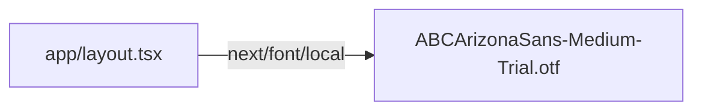

# fonts/ — overview

Local font binaries loaded via `next/font/local`. No source code — binary files only (not documented individually).

## Contents
| Item | Type | Summary |
|------|------|---------|
| ABCArizonaSans-*-Trial.otf (10 files) | binary | ABC Arizona Sans trial cuts: Thin/Light/Regular/Medium/Bold + italics. Only **Medium** is actually loaded (as `--font-arizona-sans` in [app/layout.tsx](../app/layout.tsx.md)). |
| Author-Variable.ttf | binary | Author variable font; currently unreferenced by any code. |

## Connections

## Entry points
None — assets only. Note: the Arizona Sans files are trial-licensed cuts; the 10 unused files (and Author-Variable.ttf) ship in the repo but are not bundled unless imported.

---
*Documented at commit 1cbdce5.*
