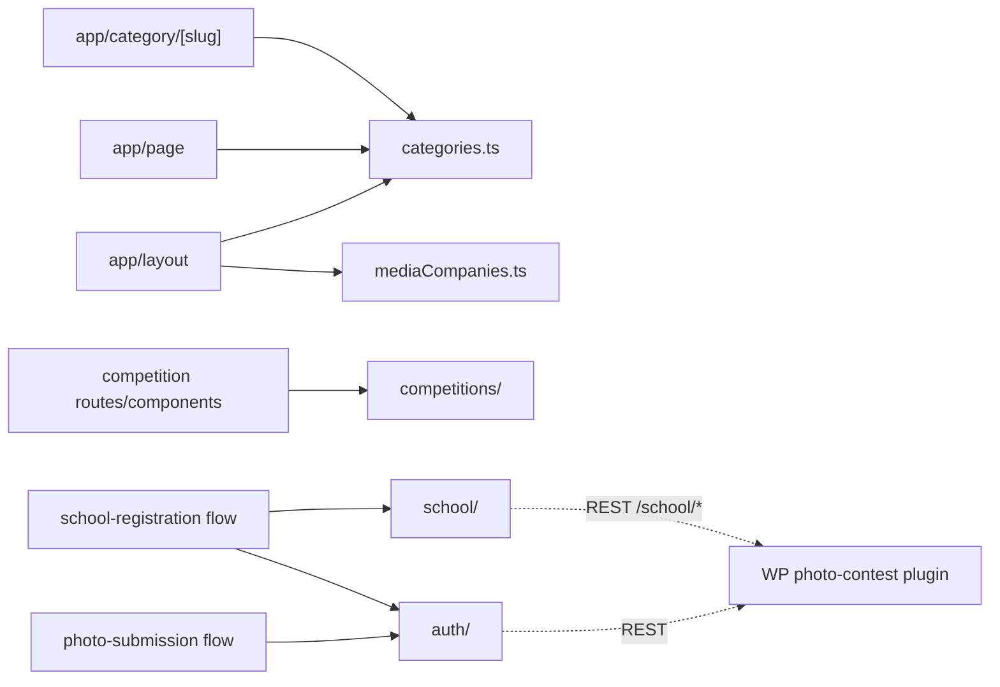

# lib/ — overview

Non-UI modules for the UMG app: site-wide data (categories, media companies) and the photo-competition domains (config, individual-flow auth/API, school-flow API).

## Contents
| Item | Type | Summary |
|------|------|---------|
| [categories.ts](categories.ts.md) | file | The 8 content categories + nav/footer slices; drives homepage sections and static category routes. |
| [mediaCompanies.ts](mediaCompanies.ts.md) | file | The 3 media companies (name, URL, color/B&W logos) for the marquee banner and footer. |
| [competitions/](competitions/README.md) | folder | Competition config-as-code: types, current competition, judges. |
| [auth/](auth/README.md) | folder | Individual-flow auth context + REST client for the WP plugin. |
| [school/](school/README.md) | folder | School-flow REST client (no dedicated auth context — reuses `auth/`'s). |

## Connections

## Entry points
No routes — imported via the `@/lib/...` alias throughout `app/` and `components/`.

---
*Documented at commit e5821d4.*
