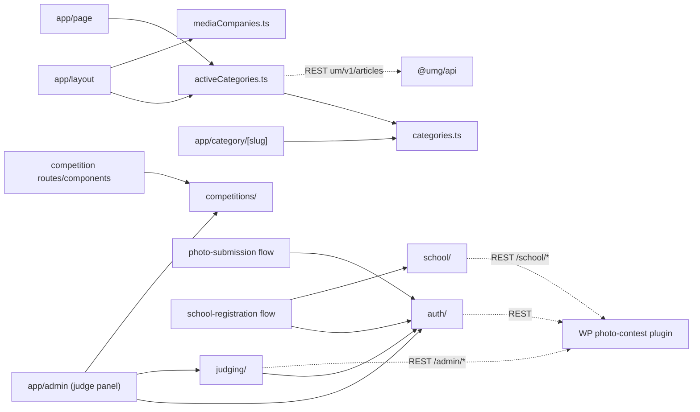

# lib/ — overview

Non-UI modules for the UMG app: site-wide data (categories, media companies) and the photo-competition domains (config, individual-flow auth/API, school-flow API, judge-panel API).

## Contents
| Item | Type | Summary |
|------|------|---------|
| [activeCategories.ts](activeCategories.ts.md) | file | Build-time filter returning only the categories that currently hold articles; feeds the nav, footer and homepage. Fails safe to the full list. |
| [categories.ts](categories.ts.md) | file | The 8 nav categories + Video Interviews (homepage/page-only, not in nav) + nav/footer slices; drives homepage sections, sitemap, and static category routes. |
| [mediaCompanies.ts](mediaCompanies.ts.md) | file | The 2 sibling media companies (name, URL, color/B&W logos) for the marquee banner and footer. |
| [competitions/](competitions/README.md) | folder | Competition config-as-code: types, current competition, judges. |
| [auth/](auth/README.md) | folder | Individual-flow auth context + REST client for the WP plugin. |
| [school/](school/README.md) | folder | School-flow REST client (no dedicated auth context — reuses `auth/`'s). |
| [judging/](judging/README.md) | folder | Judge-panel REST client + types for `/admin/*` endpoints (reuses `auth/`'s JWT and `CompetitionApiError`). |

## Connections

```mermaid
graph LR
  layout["app/layout"] --> active["activeCategories.ts"]
  active --> categories["categories.ts"]
  active -.REST um/v1/articles.-> api["@umg/api"]
  home["app/page"] --> active
  layout --> mediaCompanies["mediaCompanies.ts"]
  catRoute["app/category/[slug]"] --> categories
  compPages["competition routes/components"] --> competitions["competitions/"]
  submission["photo-submission flow"] --> auth["auth/"]
  schoolFlow["school-registration flow"] --> auth
  schoolFlow --> school["school/"]
  adminFlow["app/admin (judge panel)"] --> auth
  adminFlow --> judging["judging/"]
  adminFlow --> competitions
  judging --> auth
  judging -.REST /admin/*.-> plugin
  auth -.REST.-> plugin["WP photo-contest plugin"]
  school -.REST /school/*.-> plugin
```

## Entry points
No routes — imported via the `@/lib/...` alias throughout `app/` and `components/`.

---
*Documented at commit 5f27b41.*
