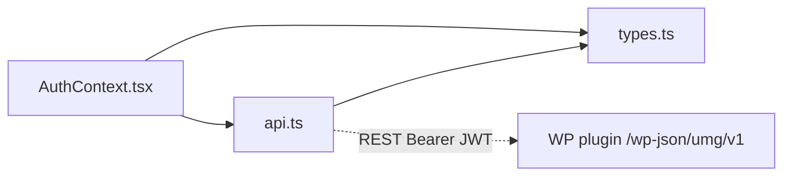

# lib/auth/ — overview

Client-side auth + submission API layer for the photo competition: type contracts, a typed fetch client for the WP plugin's REST API, and a React context that persists the JWT and exposes login/logout/refresh.

## Contents
| Item | Type | Summary |
|------|------|---------|
| [types.ts](types.ts.md) | file | snake_case JSON contracts mirroring the plugin (`User`, `AuthResponse`, `DraftData`, payloads). |
| [api.ts](api.ts.md) | file | Fetch wrappers for `/wp-json/umg/v1/*` (auth, draft CRUD, uploads, submit) + `CompetitionApiError`. |
| [AuthContext.tsx](AuthContext.tsx.md) | file | `AuthProvider` / `useAuth`: localStorage token (`umgpc_token`), OTP login, `refreshUser` payment polling. |

## Connections

Server counterparts: plugin docs at [auth.php](../../../../plugin/umg-photo-contest/includes/auth.php.md), [jwt.php](../../../../plugin/umg-photo-contest/includes/jwt.php.md), [draft.php](../../../../plugin/umg-photo-contest/includes/draft.php.md), [submission.php](../../../../plugin/umg-photo-contest/includes/submission.php.md), [payment.php](../../../../plugin/umg-photo-contest/includes/payment.php.md).

## Entry points
`AuthProvider` is mounted only in `app/photo-submission/layout.tsx`; `useAuth` and the api functions are consumed by the photo-submission page and its form components.

---
*Documented at commit 1cbdce5.*
