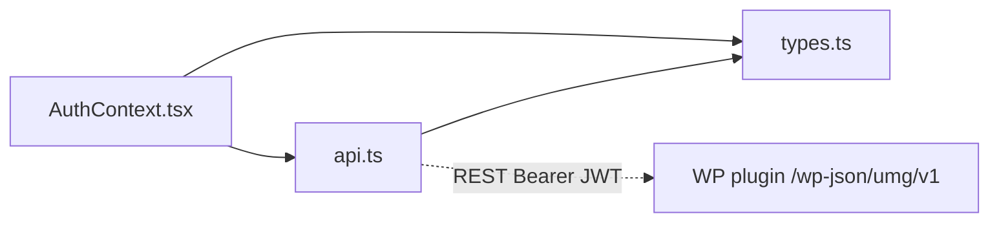

# lib/auth/ — overview

Client-side auth + submission API layer for the photo competition: type contracts, a typed fetch client for the WP plugin's REST API, and a React context that persists the JWT and exposes login/logout/refresh.

## Contents
| Item | Type | Summary |
|------|------|---------|
| [types.ts](types.ts.md) | file | snake_case JSON contracts mirroring the plugin (`User`, `AuthResponse`, `DraftData`, payloads); `User.is_judge` / `User.is_admin` and `DraftData.recommender` are optional because older plugin builds omit them. |
| [api.ts](api.ts.md) | file | Fetch wrappers for `/wp-json/umg/v1/*` (auth, draft CRUD, uploads, submit/unsubmit) + `CompetitionApiError`. |
| [AuthContext.tsx](AuthContext.tsx.md) | file | `AuthProvider` / `useAuth`: localStorage token (`umgpc_token`), OTP login, `refreshUser` payment polling (returns the fresh `User | null` so pollers can read `payment_status` without waiting for a re-render). |

## Connections

```mermaid
graph LR
  AC["AuthContext.tsx"] --> API["api.ts"]
  AC --> T["types.ts"]
  API --> T
  API -.REST Bearer JWT.-> WP["WP plugin /wp-json/umg/v1"]
```

Server counterparts: plugin docs at [auth.php](../../../../plugin/umg-photo-contest/includes/auth.php.md) (also the source of the `is_judge` / `is_admin` capability flags), [jwt.php](../../../../plugin/umg-photo-contest/includes/jwt.php.md), [draft.php](../../../../plugin/umg-photo-contest/includes/draft.php.md), [submission.php](../../../../plugin/umg-photo-contest/includes/submission.php.md), [entry-state.php](../../../../plugin/umg-photo-contest/includes/entry-state.php.md) (the shared submit/unsubmit transition), [payment.php](../../../../plugin/umg-photo-contest/includes/payment.php.md).

## Entry points
`AuthProvider` is mounted in three route layouts — `app/photo-submission/layout.tsx`, `app/school-registration/layout.tsx` and `app/admin/layout.tsx` — each as its own independent provider instance (they share the `umgpc_token` localStorage key, not React state). `useAuth` and the api functions are consumed by the photo-submission page and its form components; the school flow reuses the context but calls [lib/school/api.ts](../school/README.md) instead, and `/admin` reads only `user.is_judge` / `user.is_admin` for gating.

---
*Documented at commit 6e04fee.*
