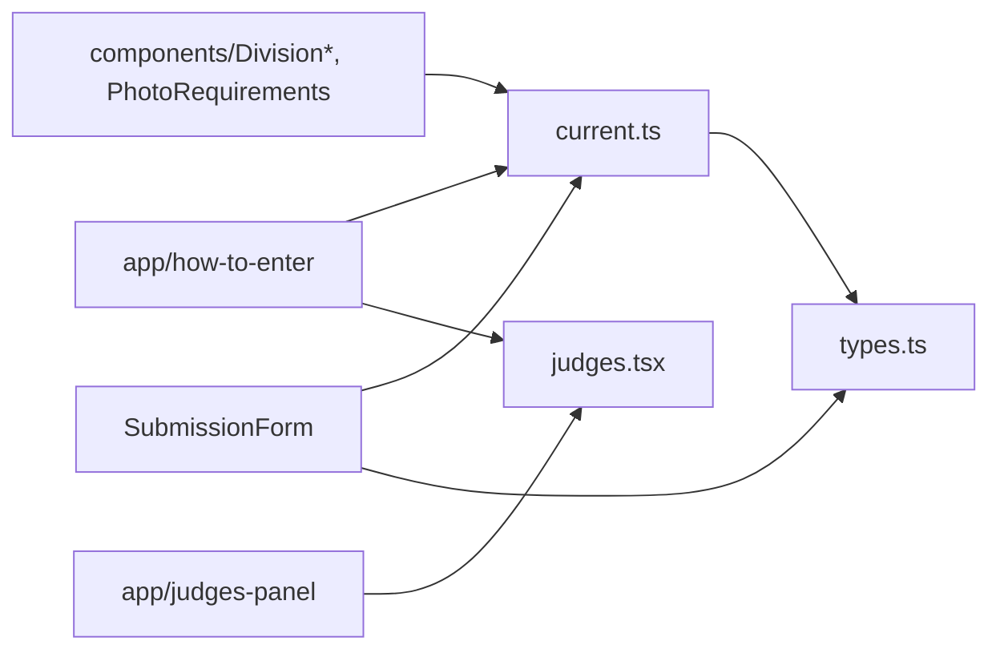

# lib/competitions/ — overview

Configuration-as-code for the photo competition: type definitions, the active competition's full content, and the judges roster. Editing competition content (dates, fees, copy, judges) happens here, not in any CMS.

## Contents
| Item | Type | Summary |
|------|------|---------|
| [types.ts](types.ts.md) | file | `Competition`, `CompetitionDivision`, awards/timeline/criteria interfaces. |
| [current.ts](current.ts.md) | file | The 2026 "My Hometown, My Lens" config: divisions, awards, rules text, venues, Stripe payment link. |
| [judges.tsx](judges.tsx.md) | file | 15 judges with JSX-capable bios and portrait paths (`public/images/judges/`). |

## Connections

## Entry points
Pure data modules — consumed by the how-to-enter, judges-panel, and photo-submission routes and the competition components. Limits/fees must stay in sync with the WP plugin's server-side enforcement and the Stripe payment link.

---
*Documented at commit 1cbdce5.*
