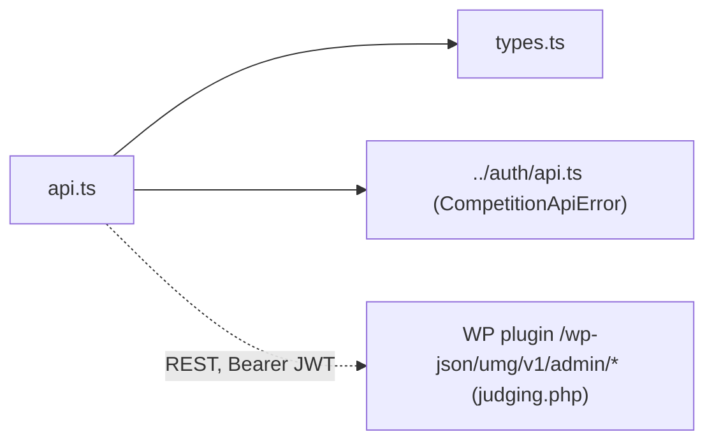

# lib/judging/ — overview

Client-side API layer for the judge panel (`/admin` routes): type contracts and a typed fetch client for the plugin's `/wp-json/umg/v1/admin/*` endpoints. Sibling of `lib/auth/` (individual flow) and `lib/school/` (bulk flow); reuses the entrant JWT and `CompetitionApiError` from `lib/auth/`.

## Contents
| Item | Type | Summary |
|------|------|---------|
| [types.ts](types.ts.md) | file | snake_case JSON contracts (`SubmissionSummary`/`List`, `SubmissionDetail`, `JudgeScore`, `SaveScorePayload`, `ResultsRow`, identity-gated `EntryIdentity`). |
| [api.ts](api.ts.md) | file | `listSubmissions`, `getSubmission`, `saveScore`, `getResults` + `criterionKey()` slug helper. |

## Connections

Server counterpart: the plugin's [judging.php](../../../../plugin/umg-photo-contest/includes/judging.php.md) + [roles.php](../../../../plugin/umg-photo-contest/includes/roles.php.md) (capabilities `umgpc_judge_submissions`, `umgpc_admin_results`; `umgpc_blind_judging` option).

## Entry points
No routes — imported via `@/lib/judging/...` by [apps/umg/app/admin/](../../app/admin/README.md). Like `lib/school/`, there is no dedicated React context: components read `token`/`user` from the shared `lib/auth/AuthContext` and pass the token explicitly. Authorization is enforced by the plugin on every request; the frontend's [AdminGuard](../../app/admin/AdminGuard.tsx.md) only reads `user.is_judge` / `user.is_admin` for UX.

---
*Documented at commit bde729d.*
