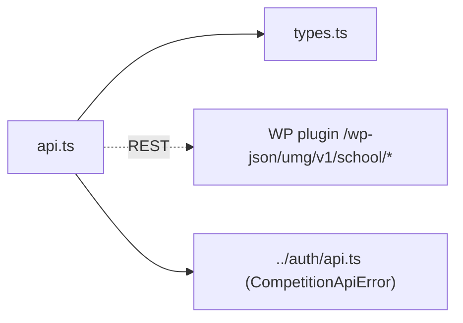

# lib/school/ — overview

Client-side API layer for the school/bulk-registration flow: type contracts and a typed fetch client for the plugin's `/wp-json/umg/v1/school/*` endpoints. Parallel to `lib/auth/` (which serves the individual flow) rather than an extension of it.

## Contents
| Item | Type | Summary |
|------|------|---------|
| [types.ts](types.ts.md) | file | snake_case JSON contracts (`ApplicationSummary`, `ApplicationDetail`, payloads, `CheckoutSessionResponse`). |
| [api.ts](api.ts.md) | file | Fetch wrappers for `/wp-json/umg/v1/school/*` (CRUD, photo upload, submit, checkout) + reuses `CompetitionApiError` from `lib/auth/api.ts`. |

## Connections

Server counterpart: plugin doc at [school.php](../../../../plugin/umg-photo-contest/includes/school.php.md).

## Entry points
No routes — imported via the `@/lib/school/...` alias by [apps/umg/app/school-registration/](../../app/school-registration/README.md)'s components. Unlike `lib/auth/`, there is no dedicated React context here — components call `api.ts` functions directly with a `token` read from the shared `lib/auth/AuthContext` (the school flow reuses that context wholesale rather than having its own).

---
*Documented at commit e5821d4.*
