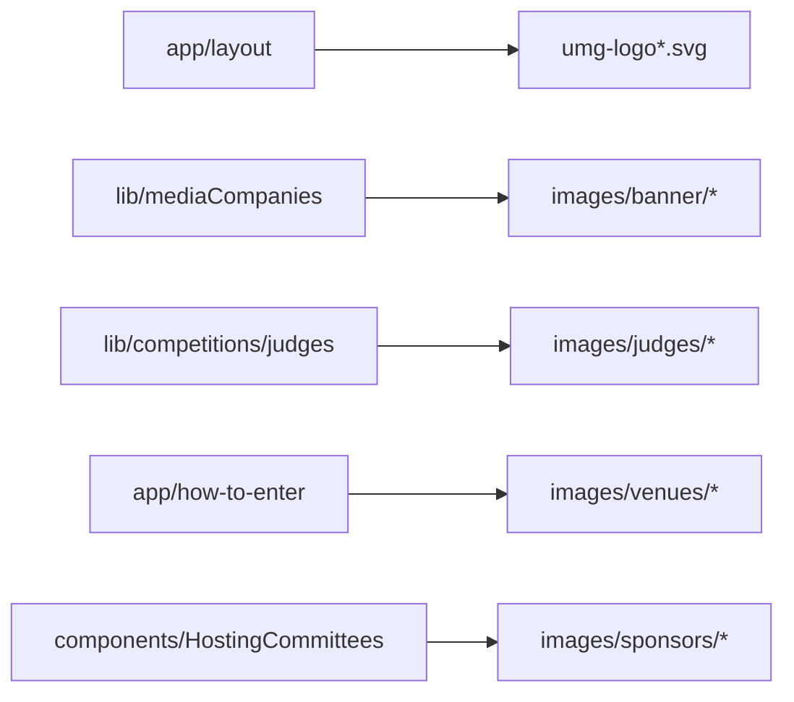

# public/ — overview

Static assets served from the site root. Images and SVGs only — no source code (not documented individually).

## Contents
| Item | Type | Summary |
|------|------|---------|
| umg-logo.svg / umg-logo-black.svg (+ .png variants) | asset | UMG brand logos: color for the Header, black for the Footer (set in [app/layout.tsx](../app/layout.tsx.md)); the color SVG is also reused by HostingCommittees. |
| images/banner/ | folder | Media-company marquee logos — color + B&W variant per company (em, is, dw), referenced by [lib/mediaCompanies.ts](../lib/mediaCompanies.ts.md). Local copies replaced WP-hosted uploads. |
| images/judges/ | folder | 15 judge portraits (`lastname-firstname.png`), referenced by [lib/competitions/judges.tsx](../lib/competitions/judges.tsx.md). |
| images/venues/ | folder | 5 exhibition-venue photos, mapped by name in [app/how-to-enter/page.tsx](../app/how-to-enter/page.tsx.md). |
| images/sponsors/ | folder | Hosting-committee logos (Chennault Foundation, International Salute, UNESCO Center for Peace) used by [components/HostingCommittees.tsx](../components/HostingCommittees.tsx.md). |
| file.svg, globe.svg, next.svg, vercel.svg, window.svg | asset | Leftover create-next-app boilerplate icons; unreferenced. |

## Connections

## Entry points
Served verbatim at `/<path>` in the static export (image optimization disabled).

---
*Documented at commit 1cbdce5.*
