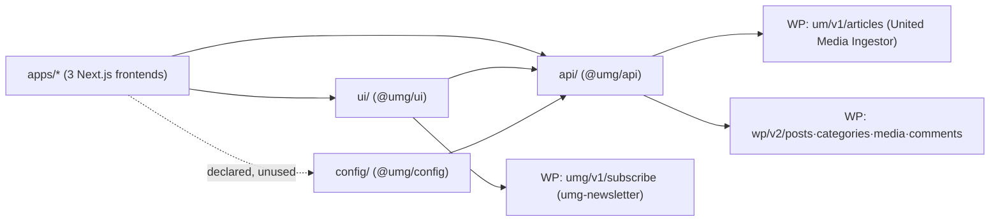

# packages — overview

The shared workspace packages of the umg-headless monorepo. All three Next.js apps (`apps/umg`, `apps/echo-media`, `apps/international-spectrum`) are thin shells over these packages: `@umg/api` is the WordPress data layer, `@umg/ui` is the component library, and `@umg/config` holds dev fixtures and the shared TS base config. Packages ship raw TypeScript (no build step) and are compiled by each app via `transpilePackages` in `next.config.ts`.

## Contents
| Item | Type | Summary |
|------|------|---------|
| [api/](api/README.md) | folder | `@umg/api` — mode-switching WordPress data layer (custom `um/v1/articles` for UMG, standard `wp/v2/*` for EM/IS), content sanitization, UI transformers, `useArticles` hook. |
| [ui/](ui/README.md) | folder | `@umg/ui` — shared React components: Header/Footer, homepage sections, search/category pages, article layout with comments, 404. |
| [config/](config/README.md) | folder | `@umg/config` — dummy section data for offline development + shared tsconfig base. Exports currently unused by apps. |

## Connections

## Entry points
- `@umg/api` ([api/index.ts](api/index.ts.md)): `fetchArticles` / `searchArticles` / `fetchArticleBySlug` / `fetchAllSlugs` / `fetchComments` / `postComment`, the `toSection*` transformers, `useArticles`, and all shared types. Backend selection via `NEXT_PUBLIC_API_MODE` + `NEXT_PUBLIC_WP_API_URL` (UMG → `api.unitedmediadc.com` custom mode; EM → `api.echo-media.info` and IS → `api.internationalspectrum.org` wp mode). See [api/README.md](api/README.md) for the full mode comparison.
- `@umg/ui` ([ui/index.ts](ui/index.ts.md)): `Header`, `Footer`, `CategorySectionWrapper` + `SeenArticlesProvider` (homepages), `CategoryContent` / `SearchContent` (listing pages), `ArticleLayout` (EM/IS article pages), `NotFoundPage`.
- WordPress plugin counterparts live in [../plugin/](../plugin/): [united-media-ingestor](../plugin/united-media-ingestor/united-media-ingestor.php.md) (serves `um/v1/articles`) and [umg-newsletter](../plugin/umg-newsletter/umg-newsletter.php.md) (serves `umg/v1/subscribe`).

---
*Documented at commit 1cbdce5.*
